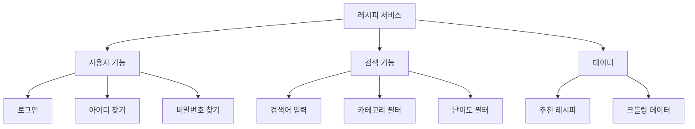
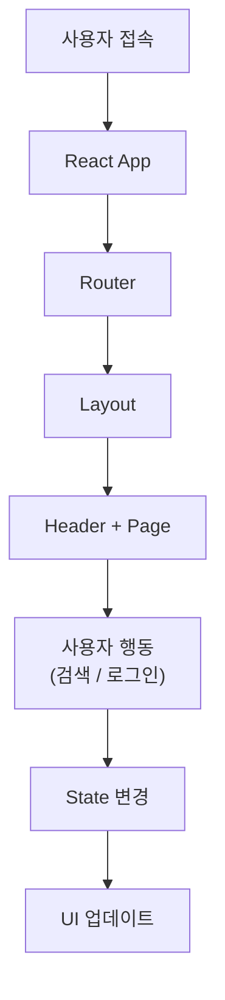

# 🧊 zero-naeng-fe

냉장고 식재료 관리 및 레시피 추천 서비스

사용자가 보유한 식재료를 관리하고 해당 재료로 만들 수 있는 레시피를 추천하여  
**식재료 소비 효율을 높이는 통합 서비스**입니다.

---

# 🎯 서비스 목표

### 1️⃣ 식재료 관리

- 냉장고 재료 등록
- 식재료 소비기한 관리
- 식재료 조회 기능

### 2️⃣ 레시피 추천

- 보유 식재료 기반 레시피 추천
- 레시피 등록 및 관리

### 3️⃣ 식비 관리

- 식재료 구매 비용 기록
- 식비 관리 지원

### 4️⃣ 통합 식생활 관리

식재료 관리 + 레시피 활용 + 식비 관리 기능을 하나의 서비스에서 제공

---

# 🚀 Sprint 계획

## 🟢 Sprint 1

핵심 CRUD 기능 구현

- 회원가입
- 로그인
- 식재료 등록
- 식재료 조회
- 레시피 등록
- 레시피 수정 / 삭제

## 🟢 Sprint 1 구현 진행 상황

Sprint 1에서는 서비스의 **핵심 인증 기능과 식재료 관리 기능(CRUD)** 구현을 목표로 한다.

### 구현 기능

- 회원가입
- 로그인
- 인증 토큰 관리
- 식재료 등록 / 조회 / 수정 / 삭제

---
## 🟢 Sprint1 진행 상황

| 단계 | 파일명 | 핵심 역할 | 상태 |
| ----- | -------- | ----------- | ------ |
| 1. 계정 생성 | SignUpPage.js | loginId, nickname 등록 및 자동 로그인 | 정상 작동 |
| 2. 인증 획득 | Login.js | AT/RT 발급 및 로컬 스토리지 저장 | 정상 작동 |
| 3. 데이터 통신 | api.js | Axios Interceptor로 토큰 자동 첨부 | 설정 완료 |
| 4. 기능 수행 | RegPage.js | 인증 기반 식재료 CRUD | 정상 작동 |

## 🟡 Sprint 2

서비스 확장 기능

- 이미지 업로드
- 음성 인식
- 카테고리 필터
- 검색 기능

---

# 🎨 디자인 시스템

### variables.css

- 색상
- 폰트
- spacing
- shadow

### global.css

- 전체 레이아웃
- 카드 스타일
- 버튼 스타일

---

# 🧠 핵심 기능 구조

---

# 🛠 기술 스택

## Frontend

- React
- React Router
- JavaScript
- CSS (Design System)

## Backend

- Spring Boot
- MySQL
- Docker

## API

- REST API
- Orval

---

# 🔄 서비스 흐름

---

# 📌 실행 방법

### 1️⃣ 프로젝트 설치
### 2️⃣ 개발 서버 실행
### 3️⃣ 접속
---

# 📦 Backend 실행

Docker 실행
Backend 서버

---

# 📚 참고 자료

React 프로젝트 구조 참고

https://grape-curiosity-e94.notion.site/35b86a30c543458c9af716c50a331b77

 
React 프로젝트 로그인 참고
https://12716.tistory.com/entry/ReactJS-%EB%A1%9C%EA%B7%B8%EC%9D%B8-%ED%8E%98%EC%9D%B4%EC%A7%80-%EA%B5%AC%ED%98%84%ED%95%98%EA%B8%B0

React 프로젝트 회원가입 참고 
https://12716.tistory.com/entry/ReactJS-%ED%9A%8C%EC%9B%90%EA%B0%80%EC%9E%85-%ED%8E%98%EC%9D%B4%EC%A7%80-%EA%B5%AC%ED%98%84%ED%95%98%EA%B8%B0?category=1023699
    
React 프로젝트 인증 참고
https://12716.tistory.com/entry/ReactJS-%EC%9D%B8%EC%A6%9D-%EC%B2%B4%ED%81%AC%ED%95%98%EB%8A%94-%EA%B8%B0%EB%8A%A5-%EA%B5%AC%ED%98%84%ED%95%98%EA%B8%B0
    
        
---

# 📌 프로젝트 한 줄 정리
구성