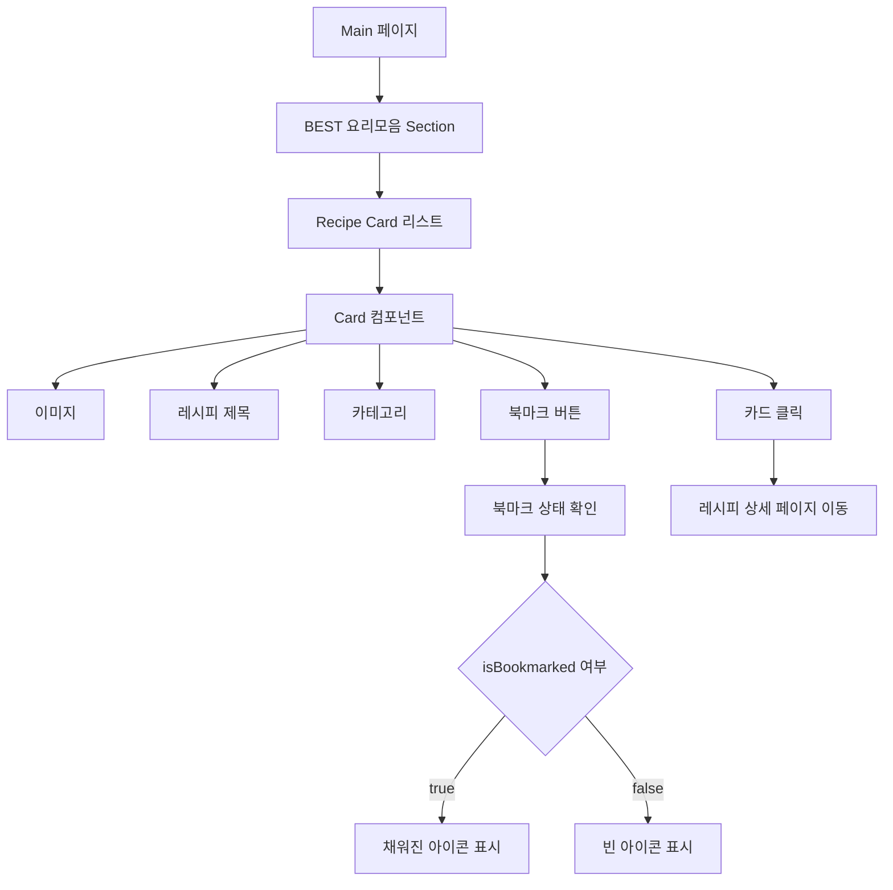
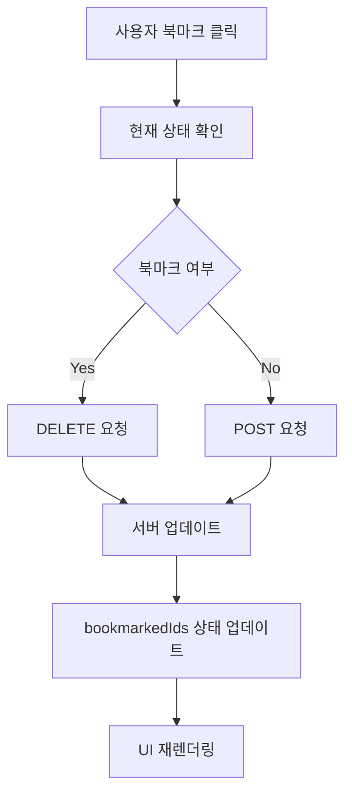

# ⭐ 좋아요 / 북마크 UI 설계 문서

> (BEST 요리모음 - Recipe Bookmark System)

---

## 1. 개요 (Overview)

본 설계는 레시피 카드 UI에서 사용자가 원하는 레시피를  
**좋아요(북마크)** 형태로 저장하고 관리할 수 있도록 하는 기능을 정의한다.

사용자는 직관적인 UI를 통해 관심 있는 레시피를 저장하고,  
이후 개인화된 추천 및 빠른 접근이 가능하도록 한다.

---

## 2. 개발 환경

| 항목 | 내용 |
| ------ | ------ |
| Frontend | React |
| 상태관리 | useState, useEffect |
| 라우팅 | React Router |
| 통신 | Axios / customInstance |
| UI 컴포넌트 | Card, Button, Section |
| 아이콘 | lucide-react |
| Backend API | REST API (Spring or FastAPI) |

---

## 3. 페이지 목적

- 사용자가 관심 있는 레시피를 **저장(북마크)** 할 수 있도록 지원
- 추천된 레시피 중 **재사용 가능한 데이터 확보**
- 사용자 행동 데이터를 기반으로 **추천 시스템 고도화**

---

## 4. 주요 기능

### ✅ 4.1 북마크 토글 기능

- 클릭 시 북마크 상태 변경
- 상태에 따라 API 요청 방식 변경

| 상태 | 동작 |
|------|------|
| 북마크 O | DELETE 요청 |
| 북마크 X | POST 요청 |

---

### ✅ 4.2 북마크 상태 유지

- 페이지 로드 시 서버에서 북마크 목록 조회
- bookmarkedIds 상태에 저장

```js
setBookmarkedIds(bookmarkRes.data || []);
```

---

### ✅ 4.3 UI 상태 반영

- Card 컴포넌트에 props 전달

```js
isBookmarked={bookmarkedIds.includes(recipe.title)}
```

---

### ✅ 4.4 이벤트 전파 방지

- 카드 클릭과 북마크 클릭 분리

```js
e.stopPropagation();
```

---

## 5. UI 구조 (Mermaid)



## 6. 핵심 기능 요약

- 북마크 상태를 서버 + 클라이언트 동기화
- 클릭 한 번으로 즉각적인 UI 반영
- 사용자 행동 데이터를 추천 시스템에 활용 가능
- UX 개선을 위한 이벤트 분리 처리

## 7. 데이터 흐름 (Data Flow)



## 8. 정리

- 북마크 기능은 단순 저장이 아닌 개인화 추천의 핵심 데이터이다.
- 프론트와 백엔드의 상태 일관성 유지가 중요하다.
- UX 측면에서 **즉각적인 피드백(UI 변화)**이 핵심이다.
