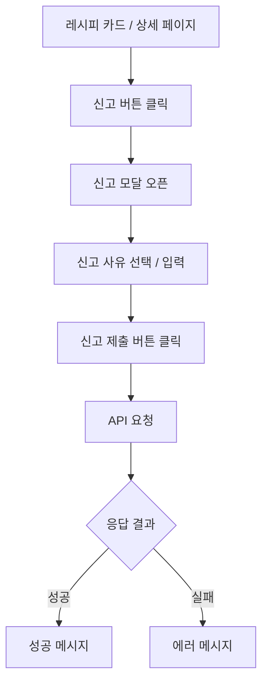
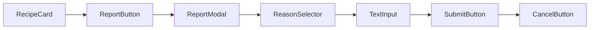
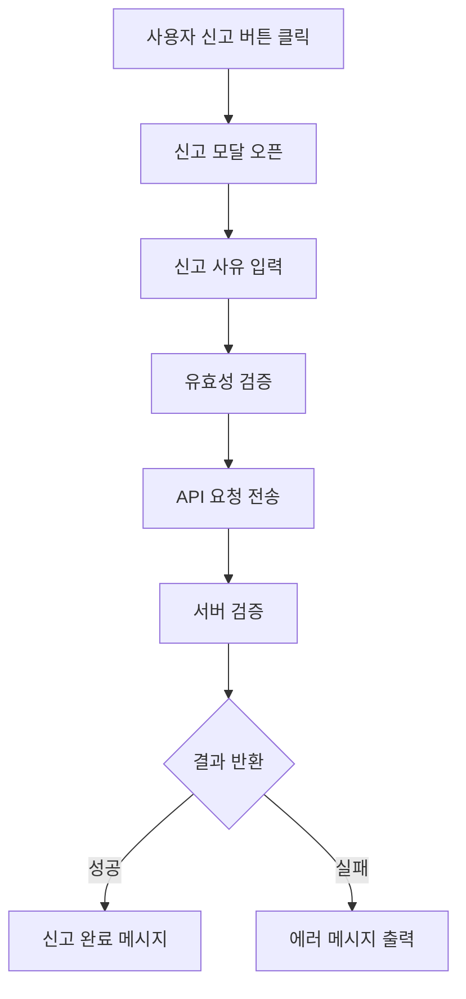

# 🚨 레시피 신고 기능 UI 설계 문서

---

## 1. 개요 (Overview)

본 기능은 사용자들이 레시피 콘텐츠 내의  
부적절한 내용, 허위 정보, 스팸 등을 신고할 수 있도록 지원하는 시스템이다.

서비스의 핵심 목표는 다음과 같다.

- 커뮤니티 신뢰도 향상
- 사용자 참여 기반 콘텐츠 관리
- 부적절 콘텐츠 필터링 자동화
- 건강한 레시피 생태계 유지

또한 다음 정책을 기반으로 설계된다.

- 동일 사용자 중복 신고 방지
- 자기 게시물 신고 제한
- 신고 사유 필수 입력

---

## 2. 개발 환경

| 항목 | 내용 |
| ------ | ------ |
| Framework | React |
| Language | JavaScript |
| Styling | CSS |
| Routing | React Router |
| State Management | useState, useEffect |
| API 통신 | Axios |
| 인증 방식 | JWT (Bearer Token) |
| UI 구성 | Component 기반 |
| Icon Library | Lucide-react |

---

## 3. 페이지 목적

본 기능의 목적은 다음과 같다.

- 사용자 주도 콘텐츠 검증 시스템 제공
- 부적절 레시피 빠른 식별 및 조치
- 신고 데이터 기반 콘텐츠 품질 개선
- 관리자 검토 시스템과 연계

---

## 4. 주요 기능

### 4-1. 신고 버튼 제공

- 레시피 카드 및 상세 페이지에 신고 아이콘 배치
- 클릭 시 신고 모달 활성화

---

### 4-2. 신고 모달 UI

- 신고 사유 선택 (라디오 버튼 또는 드롭다운)
- 직접 입력 텍스트 필드 제공
- 신고 확인 / 취소 버튼

---

### 4-3. 유효성 검증

- 사유 입력 여부 확인 (필수)
- 자기 게시물 신고 차단
- 중복 신고 방지

---

### 4-4. API 통신

- POST /api/recipes/{id}/report 요청
- JWT 인증 포함

---

### 4-5. 결과 피드백

- 성공 시: "신고가 접수되었습니다"
- 실패 시: 에러 메시지 출력

---

## 5. UI 구조

### 전체 흐름 구조



### 컴포넌트 구조



---

## 6. 핵심 기능 요약

| 기능 | 설명 |
| ------ | ------ |
| 신고 버튼 | 레시피 카드 및 상세 페이지에서 신고 가능 |
| 신고 모달 | 사유 선택 및 직접 입력 UI 제공 |
| 유효성 검증 | 사유 필수 입력, 자기 신고 차단, 중복 신고 방지 |
| API 통신 | 신고 데이터를 서버로 전달 |
| 사용자 피드백 | 성공/실패 결과 메시지 제공 |

---

## 7. 데이터 흐름 (Data Flow)

### 데이터 처리 흐름



### 상세 흐름 설명

- 사용자 액션

> 사용자가 레시피 카드 또는 상세 페이지에서 신고 버튼 클릭

- 모달 UI 활성화

> 신고 사유 선택 또는 텍스트 입력 가능

- 유효성 검증

> 신고 사유 입력 여부 확인
> 자기 게시물 신고 여부 확인
> 동일 사용자 중복 신고 여부 확인

- API 요청

```http
POST /api/recipes/{id}/report
Authorization: Bearer {token}

{
  "reason": "부적절한 레시피"
}
```

- 서버 처리

> 요청 데이터 검증
> 정책 위반 여부 체크
> 신고 데이터 저장

---

- 결과 반환

> 성공 → 신고 접수 완료
> 실패 → 에러 코드 및 메시지 반환

---

## 8. 정리

본 신고 기능은 사용자 참여를 기반으로 콘텐츠의 신뢰도를 유지하고  
서비스 품질을 지속적으로 개선하기 위한 핵심 기능이다.

단순한 신고 버튼이 아닌, 다음과 같은 역할을 수행한다.

- 커뮤니티 자율 정화 시스템 구축
- 부적절 콘텐츠의 빠른 탐지 및 대응
- 사용자 신뢰 기반 서비스 강화
- 관리자 검토 프로세스와의 연계 기반 마련

특히 다음 설계 요소가 중요하다.

- **정책 기반 검증**: 자기 신고 제한, 중복 신고 방지
- **UX 최적화**: 최소 클릭으로 신고 가능
- **명확한 피드백**: 성공/실패 메시지 제공
- **확장성 고려**: 신고 누적 시 자동 블라인드, 관리자 대시보드 연동 가능

결론적으로,  
신고 기능은 단순한 보조 기능이 아니라  
서비스의 **품질 유지와 신뢰 확보를 위한 핵심 시스템**이다.
