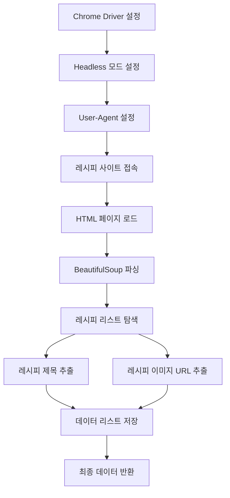
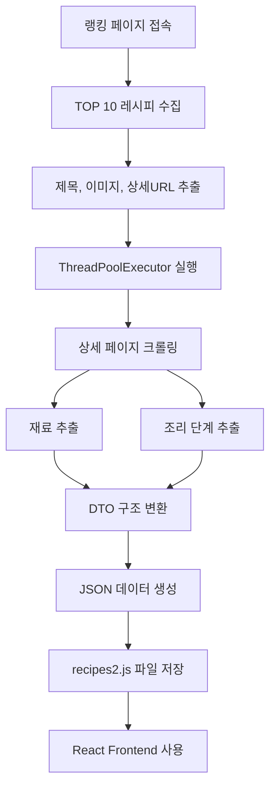
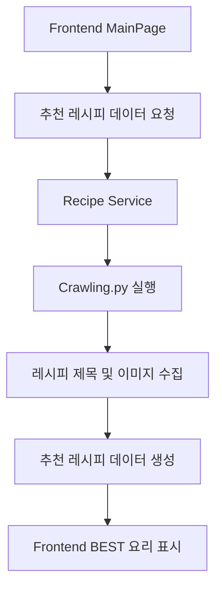

# Crawling.py 설계 문서

---

## 1. 개요 (Overview)

Crawling.py는 만개의 레시피 사이트에서 레시피 데이터를 수집하는 크롤링 시스템이다.

수집되는 데이터는 다음과 같다.

- 레시피 제목
- 썸네일 이미지
- 재료 목록
- 조리 단계
- 조리 단계 이미지

크롤링된 데이터는 백엔드 API 구조에 맞는 JSON 형태로 가공되며,
최종적으로 프론트엔드에서 사용할 수 있도록 recipes2.js 파일로 저장된다.

---

## 2. 개발 환경

| 항목 | 내용 |
| ----- | ----- |
| Language | Python |
| Crawling Tool | Selenium |
| Parsing Library | BeautifulSoup |
| Parallel Processing | ThreadPoolExecutor |
| Data Format | JSON |
| Output Format | JavaScript Data File |
| Browser | Chrome (Headless Mode) |

---

## 3. 사용 URL

레시피 제목 및 이미지 데이터를 수집하기 위한 페이지
> https://www.10000recipe.com/ranking/home_new.html

---

## 4. 사용 Selector

### 4.1 통합 Selector (레시피 리스트)

> #contents_area_full > div > ul.common_sp_list_ul.ea4 > li

---

### 4.2 제목 Selector

> div.common_sp_caption > div.common_sp_caption_tit.line2

---

### 4.3 이미지 URL Selector

> div.common_sp_thumb > a > img

---

# 5. Crawling 목적

Crawling.py는 다음과 같은 목적을 가진다.

- 레시피 제목 데이터 수집
- 레시피 이미지 URL 수집
- 추천 레시피 데이터 확보
- 향후 **Best 요리 추천 기능**에 활용

---

## 6. Crawling 동작 흐름

크롤링 과정은 다음과 같은 단계로 이루어진다.



## 7. 데이터 구조

크롤링을 통해 수집된 데이터는 다음과 같은 JSON 형태의 리스트 구조로 저장된다.

## 수집 데이터 구조

```json
{
  "title": "김치볶음밥",
  "description": "김치볶음밥의 맛있는 레시피 가이드입니다.",
  "thumbnailImageUrl": "image_url",
  "ingredients": [
    {
      "ingredientId": 1,
      "amount": "김치 1컵"
    }
  ],
  "steps": [
    {
      "stepNo": 1,
      "description": "팬에 기름을 두르고 김치를 볶는다.",
      "cookingImageUrl": "step_image"
    }
  ]
}
```


| 필드 | 설명 |
| ----- | ----- |
| title | 레시피 제목 |
| image | 레시피 이미지 URL |

---

## 8. Crawling 처리 과정

크롤링 시스템은 다음과 같은 단계로 동작한다.



## 9. 전체 프로젝트에서 위치

크롤링 시스템은 추천 레시피 데이터를 수집하는 역할을 하며,  
프론트엔드의 **BEST 요리 추천 기능**을 위한 데이터 소스로 사용된다.



## 10. 한 줄 핵심

> Crawling.py는 만개의 레시피 사이트에서 레시피 정보를 병렬로 수집하고 백엔드 DTO 구조로 변환하여 React 프론트엔드에서 사용할 수 있는 데이터 파일을 생성하는 크롤링 시스템이다.
