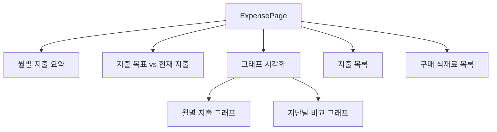
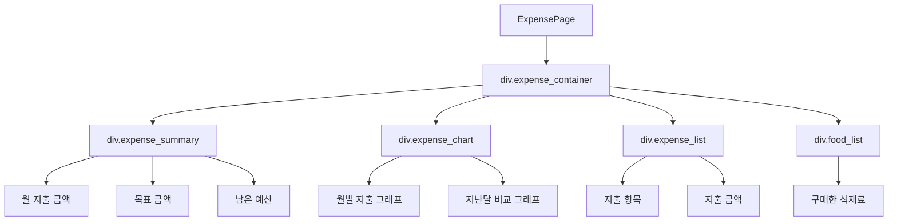
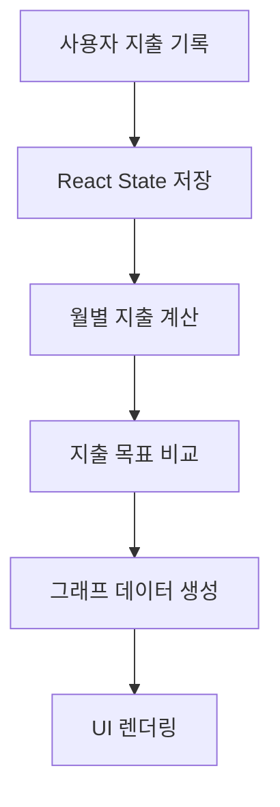
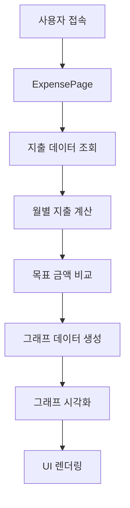

# ExpensePage 설계 문서

## 1. 개요 (Overview)

**ExpensePage**는 사용자의 식비 지출을 관리하고 시각적으로 분석할 수 있는 페이지이다.

사용자는 식재료 구매 비용을 기록하고 월별 지출 현황을 확인할 수 있으며  
지출 목표와 실제 지출을 비교하여 **합리적인 식비 관리**를 할 수 있다.

또한 그래프를 활용하여 다음 정보를 시각적으로 제공한다.

- 월별 식비 지출
- 지출 목표 대비 사용 금액
- 지난달 대비 지출 변화
- 현재 구매한 식재료 목록

이를 통해 사용자는 자신의 식비 소비 패턴을 파악하고  
**지출을 효율적으로 관리할 수 있다.**

---

# 2. 개발 환경 (Development Environment)

| 항목 | 내용 |
|---|---|
| Framework | React |
| Language | JavaScript |
| Routing | React Router |
| State Management | React useState / useEffect |
| API | Axios |
| Visualization | Chart.js / Recharts |
| Styling | CSS |
| Backend | Spring Boot |
| Database | MySQL |
| Container | Docker |

그래프 시각화 참고  
https://devskim.tistory.com/23

---

# 3. ExpensePage 목적

ExpensePage는 사용자의 식비 소비를 분석하고 관리하는 기능을 제공한다.

주요 목적

1. 월별 식비 지출 관리
2. 지출 목표 대비 현재 지출 확인
3. 지난달 대비 지출 비교
4. 현재 구매한 식재료 목록 확인
5. 그래프 기반 지출 분석

---

# 4. 주요 기능

## 1️⃣ 월별 지출 목록

사용자가 구매한 식재료의 비용을 월별로 확인할 수 있다.

예시

- 1월 식비
- 2월 식비
- 3월 식비

---

## 2️⃣ 지출 목표 대비 현재 지출

사용자가 설정한 목표 금액과 현재 지출을 비교한다.

예시

목표 식비 : 30만원  
현재 사용 : 18만원  

진행률

60%

---

## 3️⃣ 최대 사용 가능 금액 표시

현재 지출을 기반으로 **남은 예산을 계산하여 표시한다.**

예시

목표 : 30만원  
사용 : 18만원  

남은 예산

12만원

---

## 4️⃣ 현재 구매한 식재료 목록

사용자가 구매한 식재료 목록을 확인할 수 있다.

예시

- 계란
- 토마토
- 양파
- 돼지고기
- 우유

---

## 5️⃣ 지난달 지출 비교

현재 달과 지난달 지출을 비교하여 소비 패턴을 분석한다.

예시

지난달 : 22만원  
이번달 : 18만원  

지출 감소

4만원

---

# 5. UI 구조



---

# 6. DOM 구조


---

# 7. 데이터 흐름


---

# 8. 상태 관리
## ExpensePage에서는 React의 useState를 사용하여 지출 데이터를 관리한다.
```javascript
const [expenses, setExpenses] = useState([])
const [monthlyTotal, setMonthlyTotal] = useState(0)
const [goal, setGoal] = useState(300000)
```
expenses → 지출 목록 저장
monthlyTotal → 월별 지출 합계
goal → 사용자가 설정한 목표 식비

---

## 9. 그래프 시각화 구조

ExpensePage에서는 식비 데이터를 **그래프 형태로 시각화**하여 사용자에게 직관적인 소비 분석 정보를 제공한다.

그래프는 다음 데이터를 기반으로 생성된다.

| 데이터 | 설명 |
|---|---|
| monthlyExpense | 월별 지출 금액 |
| lastMonthExpense | 지난달 지출 |
| currentMonthExpense | 이번달 지출 |

### 제공 그래프 유형

- 월별 지출 그래프 (Bar Chart)
- 지난달 대비 지출 비교 그래프 (Line Chart)
- 목표 금액 대비 지출 비율 (Progress / Pie Chart)

### 사용 가능한 React 그래프 라이브러리

- Recharts
- Chart.js
- React Chartjs 2

참고 자료  
https://devskim.tistory.com/23

---

## 10. 확장성 (Scalability)

ExpensePage는 향후 기능 확장을 고려하여 설계한다.

### 1️⃣ AI 소비 분석

AI 기반 소비 패턴 분석 기능

예시

- 식비 과다 소비 분석
- 월별 소비 패턴 추천
- 개인 맞춤 식비 예산 추천

---

### 2️⃣ 식재료 관리 시스템 연동

냉장고 식재료 관리 기능과 연동하여  
식재료 구매 시 **자동으로 지출 데이터 기록**

예시

- 재료 등록 → 자동 지출 기록
- 레시피 사용 → 예상 비용 계산

---

### 3️⃣ 소비 알림 시스템

목표 금액 초과 시 사용자에게 알림 제공

예시

- "이번 달 식비 목표의 80%를 사용했습니다"
- "목표 금액을 초과했습니다"

---

### 4️⃣ 카테고리별 소비 분석

식재료를 카테고리로 분류하여 소비 분석 제공

예시

| 카테고리 | 예시 |
|---|---|
| 채소 | 양파, 토마토 |
| 육류 | 돼지고기, 닭고기 |
| 유제품 | 우유, 치즈 |
| 간식 | 과자, 아이스크림 |

---

## 11. 전체 서비스 흐름


---

# 12. 정리

## ExpensePage는 사용자의 식비 소비를 관리하고 분석할 수 있는 페이지이다.

제공 기능
	월별 식비 관리
	지출 목표 대비 소비 분석
	지난달 대비 지출 비교
	식재료 구매 목록 확인
	그래프 기반 소비 시각화

핵심 목적
    사용자가 자신의 식비 소비 패턴을 파악하고
    합리적인 소비 계획을 세울 수 있도록 지원하는 것이다.

