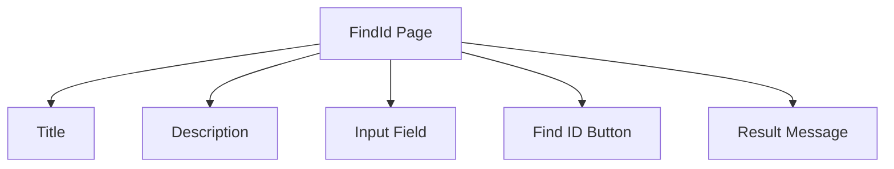
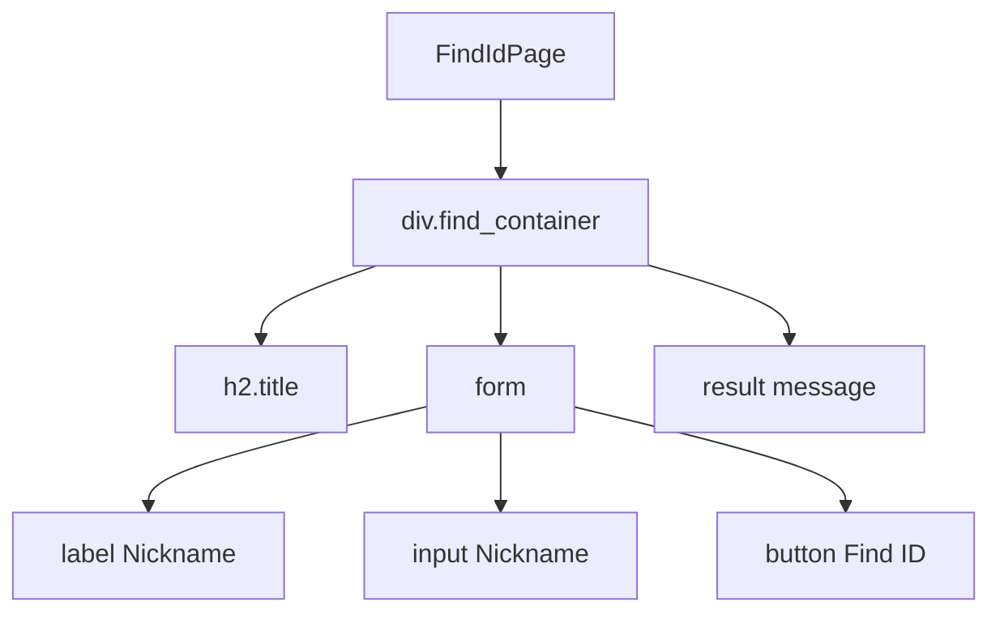
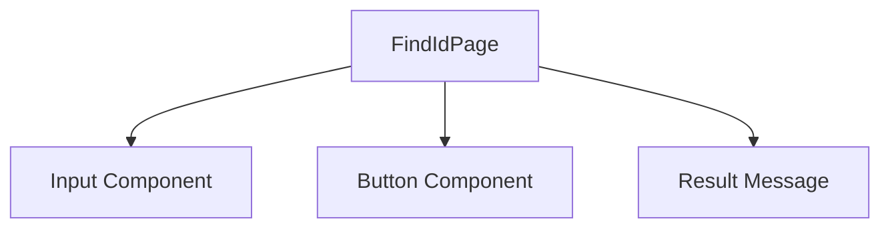
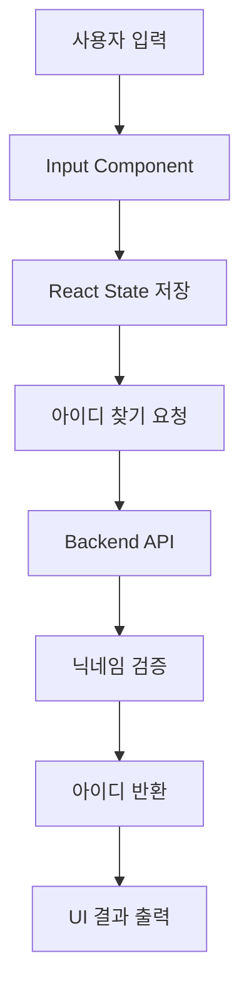
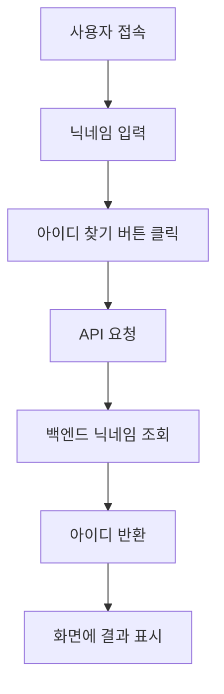

# 🔎 FindId 페이지 설계 문서

## 1. 개요 (Overview)

FindId 페이지는 사용자가 **가입 시 등록한 닉네임을 이용하여 아이디를 찾을 수 있는 기능을 제공하는 페이지**이다.

사용자는 닉네임을 입력하고 아이디 찾기 버튼을 클릭하여  
백엔드 서버에 요청을 보내고 해당 닉네임에 등록된 **아이디 정보를 확인할 수 있다.**

이 기능을 통해 사용자는 로그인 정보를 잊어버린 경우에도  
간단한 입력만으로 자신의 계정을 찾을 수 있다.

---

## 2. 개발 환경

| 항목 | 내용 |
|-----|------|
| Framework | React |
| Language | JavaScript |
| Routing | React Router |
| Component | Input, Button |
| Styling | CSS |

---

## 3. 목적 (Purpose)

FindId 페이지의 목적은 다음과 같다.

- 사용자가 **닉네임을 이용하여 자신의 아이디를 찾을 수 있도록 지원**
- 로그인 문제 발생 시 **계정 복구 기능 제공**
- 사용자 경험을 고려한 **간단한 입력 기반 아이디 찾기 기능 제공**

---

## 4. 기능 (Features)

### Input
- 사용자가 **닉네임을 입력하는 필드**

### Button
- 사용자가 **아이디 찾기 요청을 보내는 버튼**

---

## 5. UI 구조


---

## 6. DOM 구조



DOM 구조는 FindId 페이지의 HTML 구조를 나타낸다.
사용자는 닉네임을 입력하고 버튼을 클릭하여 아이디 찾기를 수행한다.

---

## 7. 컴포넌트 구조

FindId 페이지는 다음과 같은 컴포넌트 구조로 구성된다.



---

## 8. 데이터 흐름 (Data Flow)



---

## 9. API 흐름

아이디 찾기 기능은 다음과 같은 API 요청 구조를 가진다.

### 요청 (Request)

POST /api/auth/find-id

### Request Body

```json
{
  "nickname": "사용자닉네임"
}
```

### Response 

```json
{
  "nickname": "사용자닉네임"
}
```

---

## 10. 상태 관리 (State Management)

FindId 페이지에서는 React의 `useState`를 사용하여 사용자 입력과 결과 데이터를 관리한다.

### 상태 선언 예시

```javascript
const [nickname, setNickname] = useState("");
const [result, setResult] = useState("");
```

| 상태 | 역할   |   
|---------|-----------------------|
| nickname  | 사용자가 입력한 닉네임을 저장 |
| result    | 서버에서 반환된 아이디 정보를 저장 |


사용자가 닉네임을 입력하면 nickname 상태에 저장되고,
아이디 찾기 요청 이후 서버 응답 결과는 result 상태에 저장된다.

---

## 11. 동작 흐름 (Process Flow)




### 동작 과정 설명
	1.	사용자가 FindId 페이지에 접속
	2.	닉네임을 입력
	3.	아이디 찾기 버튼 클릭
	4.	프론트엔드에서 아이디 찾기 API 요청
	5.	백엔드에서 닉네임을 기준으로 사용자 조회
	6.	해당 사용자의 아이디 반환
	7.	프론트엔드에서 결과 화면에 아이디 표시
---
