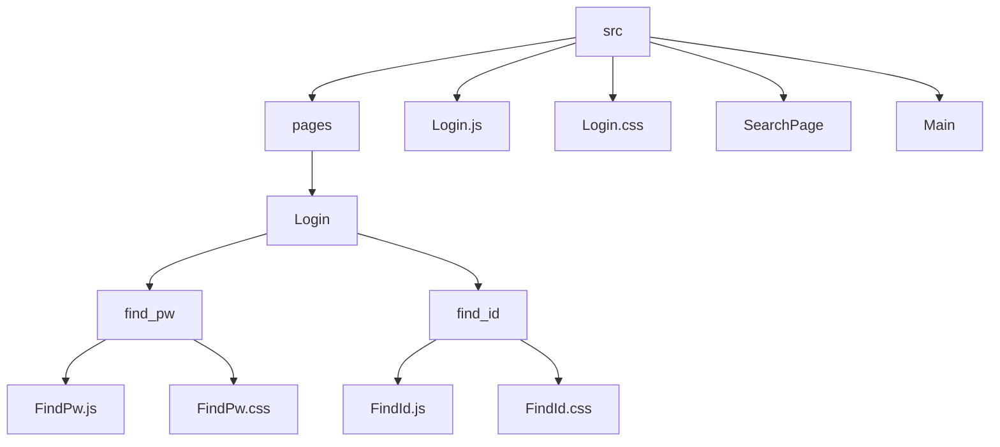
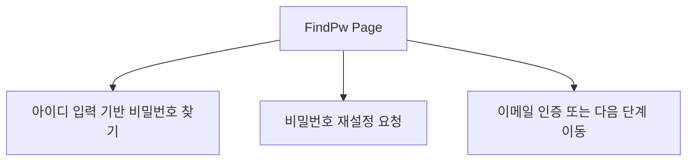
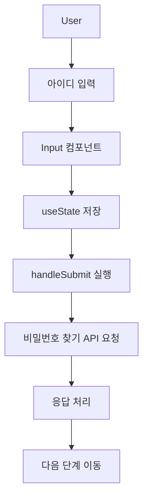
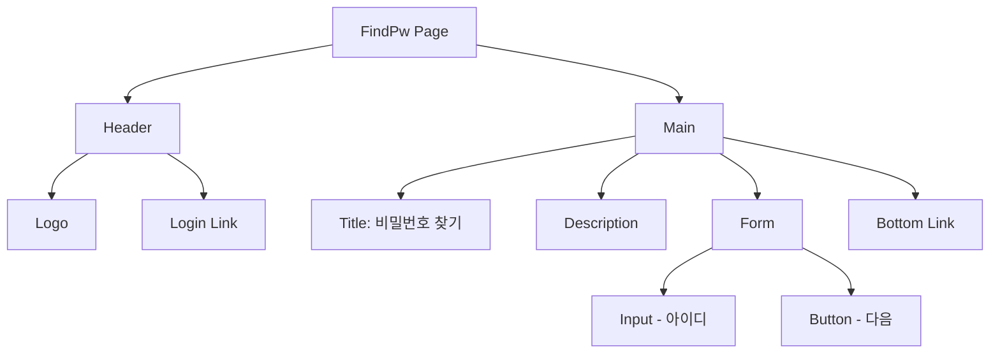
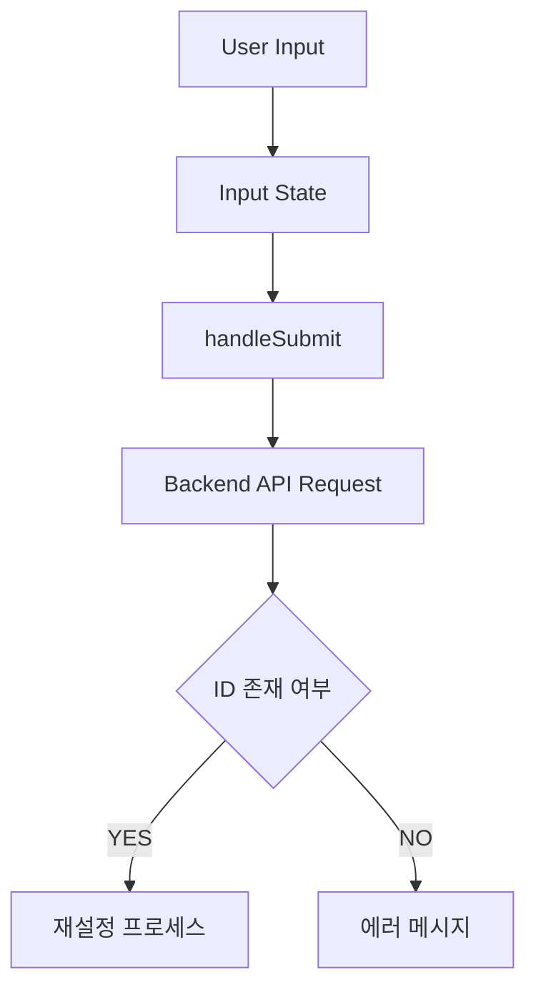
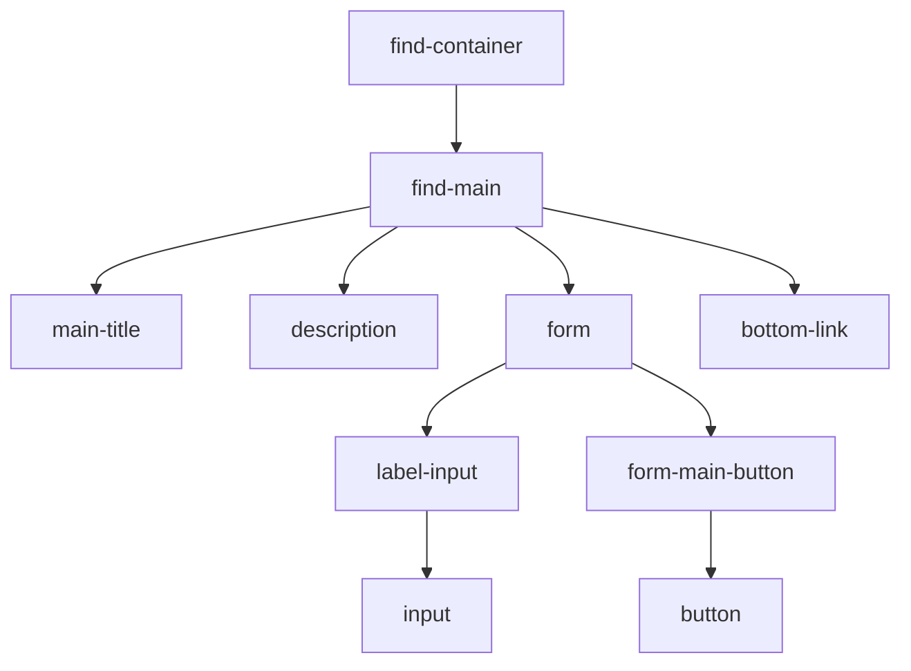
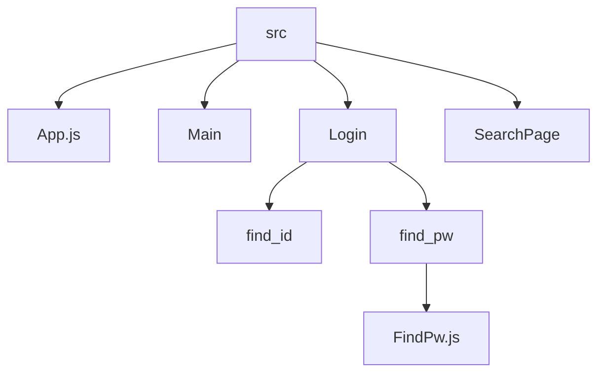

# 📄 FindPw 설계 문서

---

## 1. 개요 (Overview)

FindPw 페이지는 사용자가 비밀번호를 찾기 위해 아이디를 입력하는 페이지이다.

입력된 아이디를 기반으로 비밀번호 재설정 요청을 수행하며,
추후 이메일 인증 및 비밀번호 변경 페이지로 확장될 수 있는 구조이다.

---

## 2. 개발 환경

| 항목 | 내용 |
| ------ | ------ |
| Framework | React |
| Language | JavaScript |
| Routing | React Router |
| Component | Input, Button |
| Styling | CSS |

---

## 3. 폴더 구조 (Mermaid)

---

## 4. FindPw 목적 (Mermaid)

---

## 5. 주요 기능 (Mermaid)

---

## 6. UI 구조 (Mermaid)

---

## 7. 데이터 흐름 (Mermaid)

---

## 8. DOM 구조 (Mermaid)

---

## 9. 전체 프로젝트 구조에서 위치 (Mermaid)

---

## 10. 한 줄 핵심

> FindPw 페이지는 아이디 입력을 기반으로 비밀번호 재설정을 시작하는 인증 보조 페이지이다.
