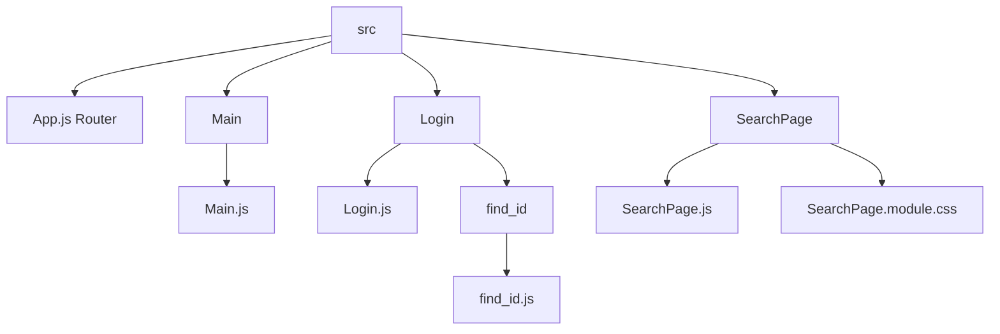
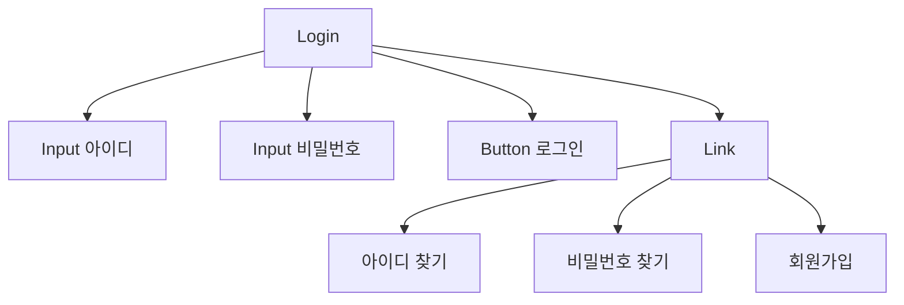
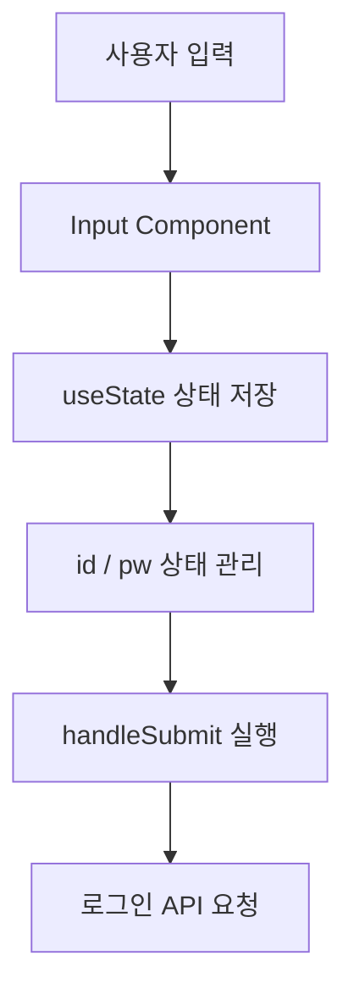
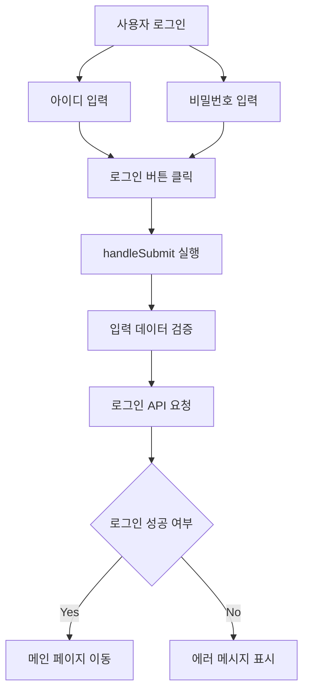
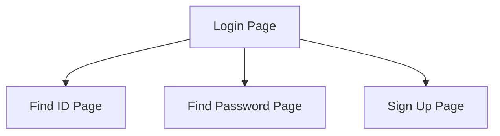
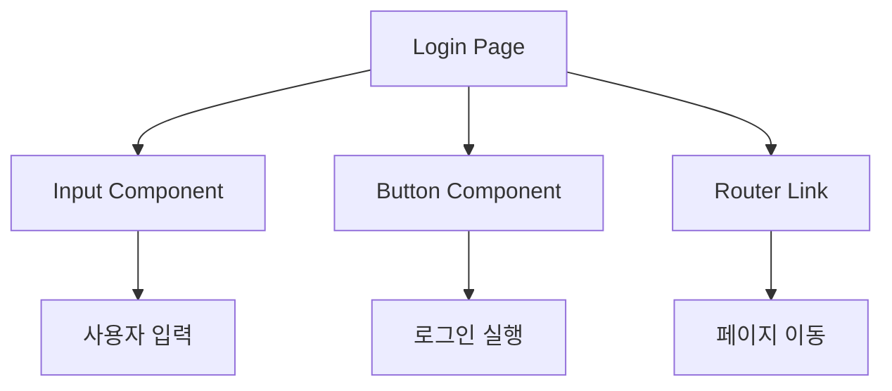

# Login 페이지 설계 문서

---

# 1. 개요 (Overview)

Login 페이지는 사용자가 **zero-naeng-fe 서비스에 로그인하기 위한 화면**을 제공한다.

사용자는 **아이디와 비밀번호를 입력하여 로그인할 수 있으며**,  
로그인 이후 서비스의 주요 기능을 사용할 수 있다.

---

# 2. 개발 환경

| 항목 | 내용 |
|-----|-----|
| Framework | React |
| Language | JavaScript |
| Routing | React Router |
| Component | Input, Button |
| Styling | CSS |

---

# 3. 프로젝트 폴더 구조



# 4. Login 페이지 목적

Login 페이지는 사용자가 아이디와 비밀번호를 입력하여 로그인할 수 있는 UI 제공을 목표로 한다.

또한 다음 기능을 지원한다.
	•	로그인 처리
	•	아이디 찾기 페이지 이동
	•	비밀번호 찾기 페이지 이동
	•	회원가입 페이지 이동

# 5. Login 주요 기능

```mermaid
flowchart TD
	A[Login 기능]

	A --> B[입력 기능]
	B --> B1[아이디 입력]
	B1 --> B2[실시간 이메일 형식 검사]

	B --> B3[비밀번호 입력]
	B3 --> B4[실시간 비밀번호 검사]
	B3 --> B5[비밀번호 보기 아이콘]

	A --> C[입력 검증]
	C --> C1[이메일 형식 검사]
	C --> C2[비밀번호 길이 검사]
	C --> C3[에러 메시지 표시]
	C --> C4[Input 에러 테두리]

	A --> D[로그인 처리]
	D --> D1[handleSubmit]
	D1 --> D2[Enter 키 로그인]
	D1 --> D3[로그인 API 요청]

	A --> E[페이지 이동]
	E --> E1[/find-id]
	E --> E2[/find-pw]
	E --> E3[/join]
```

# 6. 컴포넌트 구조


## 7. 핵심 기능 요약

| 기능 | 설명 |
|-----|-----|
| 입력 관리 | React의 `useState`를 사용하여 사용자 입력 상태를 관리 |
| 실시간 입력 검사 | 이메일 형식 및 비밀번호 길이 검증 |
| 에러 메시지 표시 | 입력 오류 발생 시 `hint_text` 표시 |
| 로그인 실행 | `handleSubmit()` 함수로 로그인 처리 |
| Enter 로그인 | `form submit` 기능을 통해 Enter 키 로그인 지원 |
| 비밀번호 보기 | `toggle password` 기능을 통해 비밀번호 표시 |
| 페이지 이동 | `React Router`의 `Link` 컴포넌트 사용 |

---

## 8. 상태 관리

Login 페이지에서는 **React의 `useState`를 사용하여 사용자 입력 상태를 관리한다.**

### 상태 선언 예시

```javascript
const [id, setId] = useState("");
const [pw, setPw] = useState("");
```

## 9. 데이터 흐름 (Data Flow)

사용자가 입력한 데이터는 다음 흐름을 통해 로그인 요청으로 전달된다.

### 데이터 흐름 다이어그램



## 10. 로그인 처리 흐름

사용자가 로그인 버튼을 클릭하면 다음과 같은 과정이 수행된다.

### 로그인 처리 과정

1. 사용자가 아이디와 비밀번호를 입력한다.
2. 로그인 버튼을 클릭하거나 Enter 키를 누른다.
3. `handleSubmit()` 함수가 실행된다.
4. 입력 데이터에 대한 유효성 검사를 수행한다.
5. 검증이 완료되면 로그인 API 요청을 수행한다.
6. 로그인 성공 시 메인 페이지로 이동한다.
7. 로그인 실패 시 에러 메시지를 표시한다.

### 로그인 처리 흐름 다이어그램



## 11. Router 연결

Login 페이지에서는 **React Router**를 사용하여 다른 페이지로 이동한다.

### Router 경로

| 기능 | URL 경로 |
|-----|----------|
| 아이디 찾기 | `/find-id` |
| 비밀번호 찾기 | `/find-pw` |
| 회원가입 | `/join` |

### Router 동작 구조


## 12. 정리

Login 페이지는 **사용자 인증을 수행하는 핵심 화면**이며  
사용자가 서비스에 접근하기 위해 반드시 거쳐야 하는 페이지이다.

사용자는 **아이디와 비밀번호를 입력하여 로그인**할 수 있으며  
입력값 검증과 오류 메시지 표시 기능을 통해 사용자 경험을 향상시킨다.

---

### 제공 기능

- 사용자 로그인 기능
- 입력 데이터 유효성 검사
- 에러 메시지 표시
- 비밀번호 보기 기능
- 계정 관련 페이지 이동

---

### Login 페이지 구성 요소

| 구성 요소 | 역할 |
|-----------|------|
| Input | 사용자 아이디 및 비밀번호 입력 |
| Button | 로그인 요청 실행 |
| Router Link | 계정 관련 페이지 이동 |

---

### Login 페이지 구조 요약

