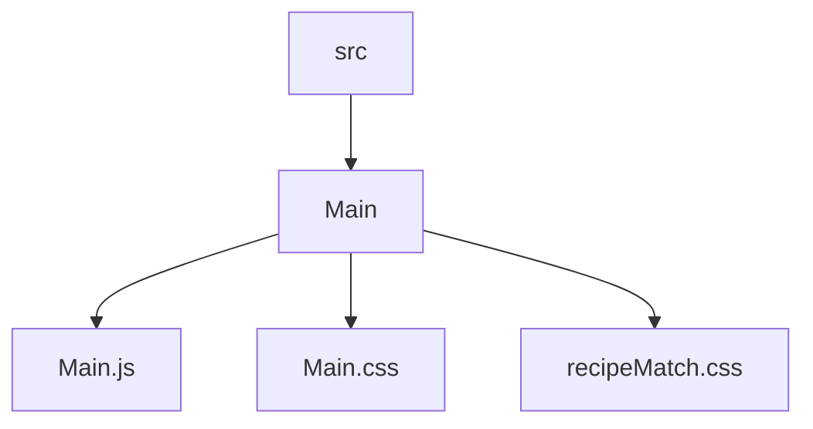
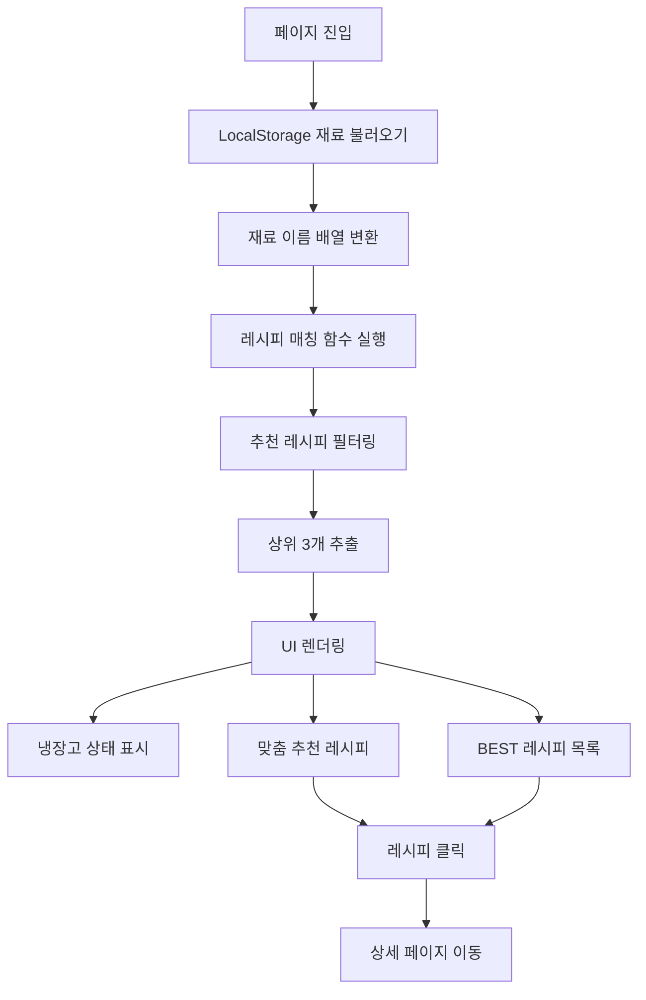
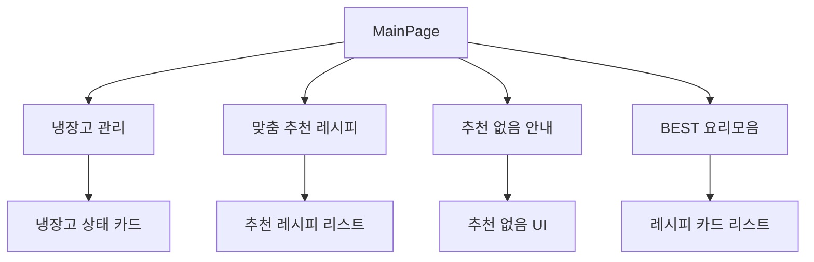
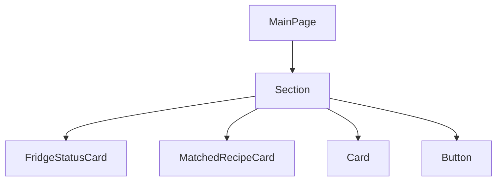
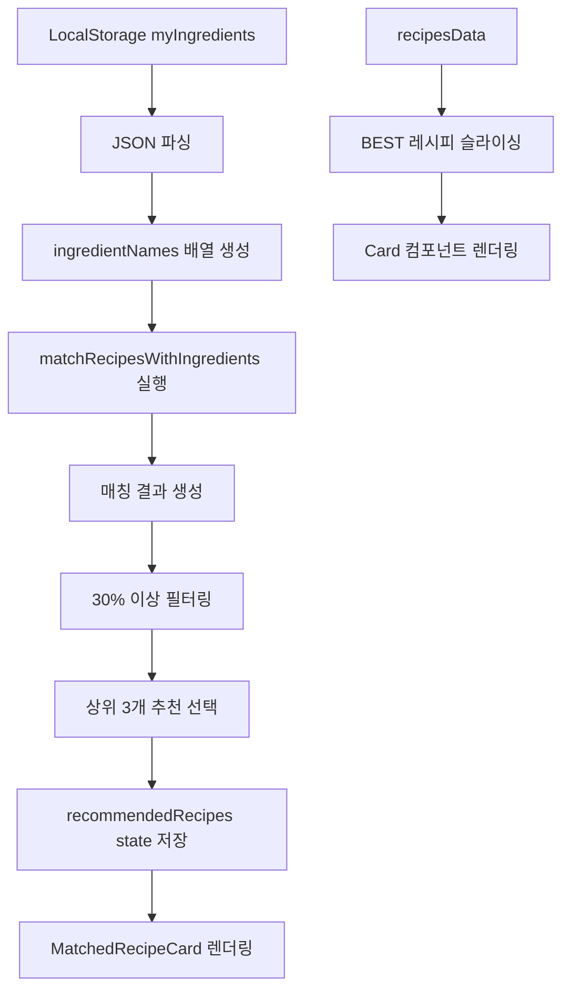
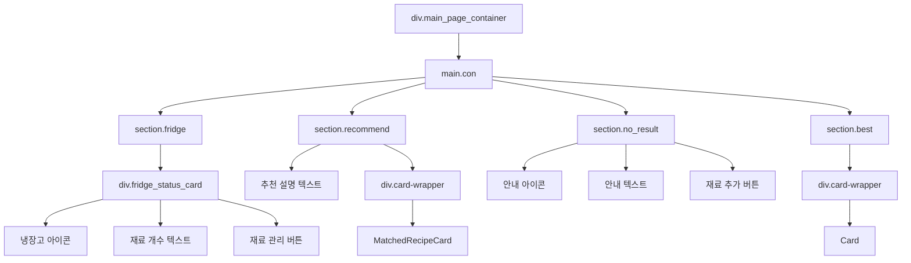
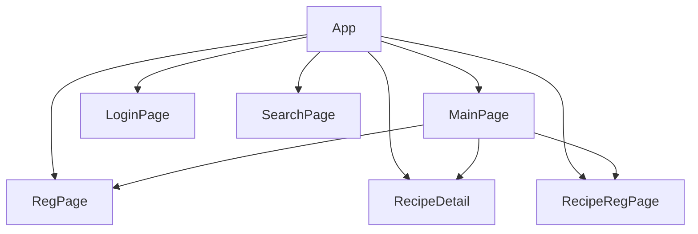

# MainPage 설계 문서

---

## 1. 개요 (Overview)

Main 페이지는 zero-naeng-fe 서비스의 메인 화면을 제공하는 페이지이다.  

사용자는 보유한 식재료를 기반으로 맞춤 레시피를 추천받을 수 있으며,  
BEST 요리 목록도 함께 확인할 수 있다.  

또한 재료 관리 페이지 및 레시피 등록 페이지로 이동할 수 있는  
허브 역할을 수행한다.

---

## 2. 개발 환경

| 항목       | 내용            |
|------------|-----------------|
| Framework  | React           |
| Language   | JavaScript      |
| Routing    | React Router    |
| Component  | Card, Button, Section |
| Styling    | CSS             |

---

## 3. 폴더 구조 (Mermaid)

---

## 4. MainPage 목적

- 사용자 보유 재료 기반 맞춤 레시피 추천 제공  
- BEST 레시피 목록 제공  
- 재료 관리 및 레시피 등록 페이지로 이동 기능 제공  
- 서비스의 메인 진입점(허브) 역할 수행  

---

## 5. 주요 기능 (Mermaid)

---

## 6. UI 구조 (Mermaid)

---

## 7. 컴포넌트 구조 (Mermaid)

---

## 8. 데이터 흐름 (Mermaid)

---

## 9. DOM 구조

---

## 10. 전체 프로젝트 구조에서 위치 (Mermaid)

---

## 11. 핵심 설계 포인트

- LocalStorage 기반으로 사용자 재료 데이터를 유지하여 상태 지속성 확보  
- 재료 기반 레시피 매칭 로직(matchRecipesWithIngredients)으로 개인화 추천 구현  
- 조건부 렌더링을 통해 추천 결과 유무에 따른 UX 분기 처리  
- Section 컴포넌트를 활용한 일관된 레이아웃 구조 설계  
- Card / MatchedRecipeCard 분리로 재사용성과 확장성 확보  
- 메인 페이지에서 재료 관리, 추천, 탐색 기능을 통합 제공  

---

## 12. 한 줄 핵심

> 사용자 재료를 기반으로 맞춤 레시피를 추천하고 서비스의 중심 역할을 수행하는 메인 페이지
