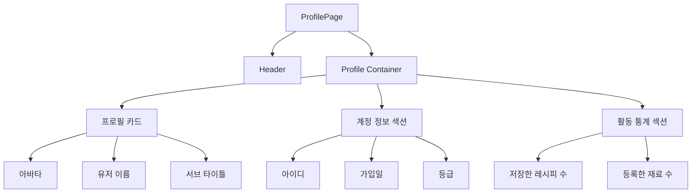
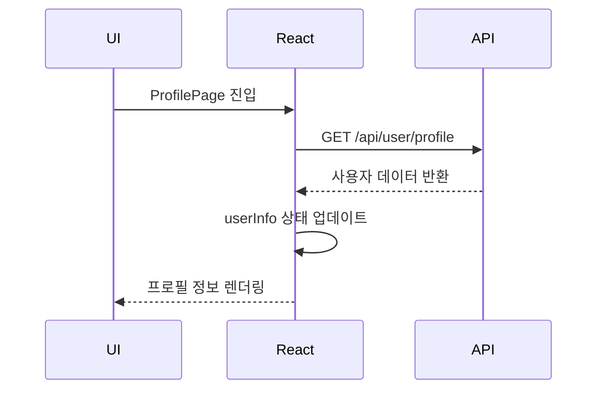

# 📄 ProfilePage 설계 문서

---

## 1. 개요 (Overview)

ProfilePage는 사용자 개인 정보를 조회하고 시각적으로 제공하는 페이지이다.  
로그인된 사용자의 계정 정보와 활동 통계를 한눈에 확인할 수 있도록 구성된다.

사용자는 해당 페이지에서 자신의 아이디, 가입일, 등급과 함께  
등록한 재료 수 및 저장한 레시피 수 등의 활동 데이터를 확인할 수 있다.

---

## 2. 개발 환경

| 항목 | 내용 |
| ------ | ------ |
| Framework | React |
| Language | JavaScript |
| API 통신 | Axios (customInstance) |
| Routing | React Router |
| Styling | CSS |
| Icon | lucide-react |

---

## 3. 페이지 목적

ProfilePage의 주요 목적은 다음과 같다:

- 사용자 계정 정보 제공
- 사용자 활동 데이터 시각화
- 개인화된 서비스 경험 제공
- 서비스 이용 현황 확인 기능 제공

---

## 4. 주요 기능

- 사용자 프로필 정보 조회 (API 연동)
- 계정 정보 표시 (아이디, 가입일, 등급)
- 활동 통계 표시 (레시피 수, 재료 수)
- 로딩 상태 기본값 처리
- 에러 발생 시 콘솔 로깅

---

## 5. UI 구조

## 6. 핵심 기능 요약

- `useEffect`를 활용한 초기 데이터 로딩 처리
- Axios(customInstance)를 통한 사용자 정보 API 호출
- 서버 응답 데이터를 기반으로 상태(`userInfo`) 업데이트
- 재사용 컴포넌트(`InfoItem`, `StatCard`)로 UI 구성
- 기본값 설정을 통한 로딩 상태 대응
- API 실패 시 에러 로그 처리 (console.error)

---

## 7. 데이터 흐름 (Data Flow)

### 📌 상세 흐름 설명

1. 페이지 최초 진입 시 `useEffect`가 실행된다.  
2. `customInstance`를 통해 `/api/user/profile` API 요청을 보낸다.  
3. 서버로부터 사용자 정보 (`response.data.data`)를 응답받는다.  
4. 응답 데이터를 기반으로 `userInfo` 상태를 업데이트한다.  
5. 상태 변경에 따라 React가 컴포넌트를 자동으로 리렌더링한다.  
6. 사용자 정보 및 활동 통계가 UI에 반영된다.  
7. API 호출 실패 시 콘솔에 에러를 출력하고 기본값을 유지한다.  

---

## 8. 정리

ProfilePage는 사용자 데이터를 기반으로 개인화된 정보를 제공하는 페이지이다.  
API 통신을 통해 최신 데이터를 가져오고, 상태 관리를 통해 UI에 반영한다.  

재사용 가능한 컴포넌트를 활용하여 구조를 단순화하고 유지보수성을 높였으며,  
확장성을 고려한 설계로 향후 기능 추가(회원 정보 수정, 로그아웃 등)에 용이하다.
