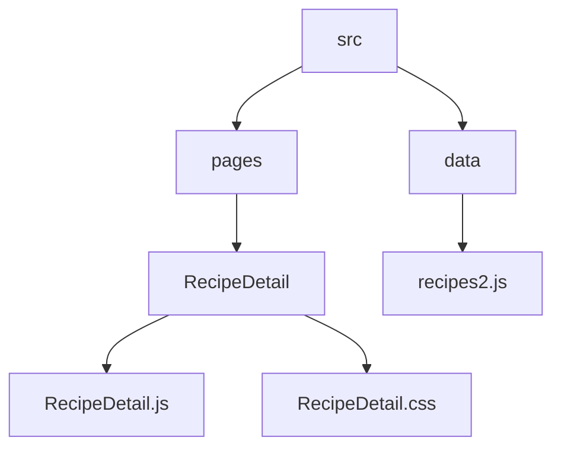
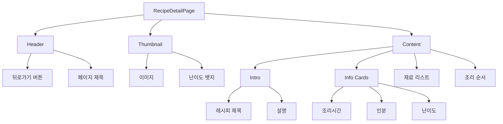
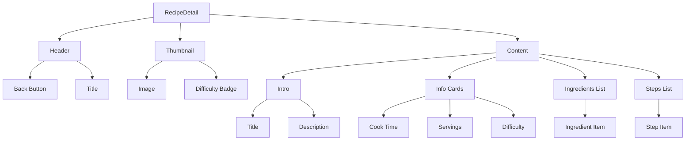
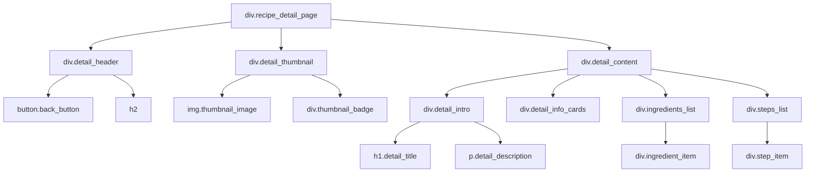
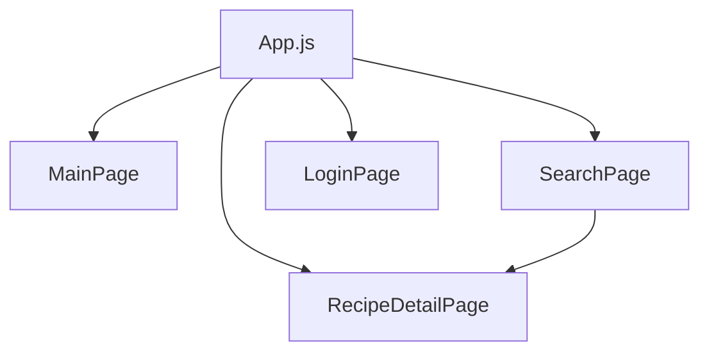

# RecipeProvidePage 설계 문서

---

## 1. 개요 (Overview)

RecipeProvidePage는 사용자가 선택한 레시피의 상세 정보를 확인할 수 있는 페이지이다.

사용자는 레시피의 이미지, 설명, 조리 시간, 인분, 난이도, 재료 목록, 조리 순서를 직관적으로 확인할 수 있으며,  
뒤로가기 기능을 통해 이전 페이지로 쉽게 이동할 수 있다.

---

## 2. 개발 환경

| 항목 | 내용 |
| ------ | ------ |
| Framework | React |
| Language | JavaScript (TypeScript 일부 문법 사용) |
| Routing | React Router |
| Styling | CSS |
| Icon | lucide-react |

---

## 3. 폴더 구조

## 3. 폴더 구조 (Mermaid)



## 4. RecipeProvidePage 목적

- 레시피 상세 정보 제공
- 크롤링 데이터를 사용자에게 시각적으로 전달
- 재료 및 조리 과정을 직관적으로 표현
- 사용자 경험 중심의 모바일 UI 제공

---

## 5. 주요 기능

```mermaid
flowchart TD
    A[페이지 진입] --> B[URL 파라미터(title) 수신]
    B --> C[recipes2 데이터 검색]
    C --> D{데이터 존재 여부}

    D -->|YES| E[레시피 상세 UI 렌더링]
    D -->|NO| F[에러 메시지 출력]

    E --> G[재료 목록 출력]
    E --> H[조리 순서 출력]
    E --> I[뒤로가기 기능]
```

## 6. UI 구조



## 7. 컴포넌트 구조



## 8. 데이터 흐름

```mermaid
flowchart TD
    A[사용자 접근 /recipe/:title]
        ↓
    B[useParams로 title 추출]
        ↓
    C[decodeURIComponent(title)]
        ↓
    D[recipes2 배열에서 find()]
        ↓
    E{데이터 존재 여부}

    E -->|YES| F[레시피 상세 UI 렌더링]
    E -->|NO| G[에러 메시지 출력]
```

## 9. DOM 구조



## 10. 전체 프로젝트 구조에서 위치



## 11. 핵심 설계 포인트

- URL 파라미터 기반 데이터 조회 (React Router의 `useParams` 활용)
- 크롤링 데이터(`recipes2.js`)를 활용한 정적 데이터 구조
- 조건부 렌더링을 통한 예외 처리 (데이터 없을 경우 에러 UI)
- 컴포넌트 단순화로 유지보수성과 가독성 향상
- 모바일 중심 UI 설계 (max-width 기반 레이아웃)
- 카드형 정보 구조로 사용자 경험 개선

---

## 12. 한 줄 핵심

> 👉 URL 파라미터를 기반으로 레시피 데이터를 조회하고, 상세 정보를 직관적으로 제공하는 페이지
