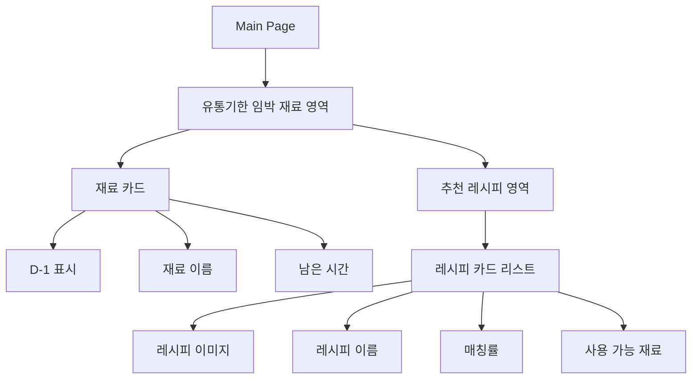
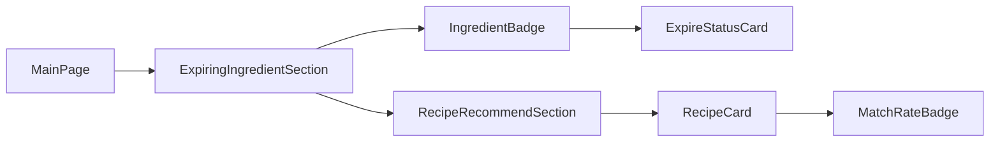
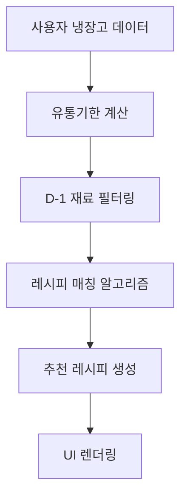

# 곧 버려질 재료 기반 레시피 추천 UI 설계 문서

---

## 1. 개요 (Overview)

본 UI는 사용자의 냉장고 재료 중  
유통기한이 1일 이하로 남은 재료를 우선적으로 분석하여  
해당 재료를 활용할 수 있는 레시피를 추천하는 기능이다.

서비스의 핵심 목표는 다음과 같다.

- 음식물 쓰레기 감소
- 냉장고 재료 소비율 증가
- 사용자 맞춤형 레시피 추천
- 재료 유통기한 시각화 제공

사용자는 메인 화면에서  
곧 폐기될 가능성이 있는 재료를 직관적으로 확인할 수 있으며,  
즉시 활용 가능한 레시피를 카드 형태로 추천받는다.

---

## 2. 개발 환경

| 항목 | 내용 |
| ------ | ------ |
| Framework | React |
| Language | JavaScript |
| Styling | CSS |
| Routing | React Router |
| State Management | useState, useEffect |
| API 통신 | Axios |
| Icon Library | Lucide-react |
| UI 구조 | Component 기반 설계 |

---

## 3. 페이지 목적

본 페이지의 목적은 다음과 같다.

- 유통기한 임박 재료 확인
- 소비 우선순위 제공
- 음식물 낭비 최소화
- 재료 기반 레시피 추천
- 사용자 냉장고 데이터 시각화

특히 “1일 남음” 상태의 재료를 우선적으로 강조하여  
사용자가 빠르게 행동할 수 있도록 유도한다.

---

## 4. 주요 기능

### 4-1. 유통기한 임박 재료 표시

- 남은 기간 계산
- D-1 재료 강조
- 위험 재료 색상 표시

---

### 4-2. 레시피 자동 추천

- 보유 재료 기반 매칭
- 유통기한 임박 재료 우선 반영
- 레시피 매칭률 계산

---

### 4-3. 재료 상태 시각화

- 재료 태그 UI
- 상태 배지 제공
- 위험 단계 표시

예시

- D-1 → 빨간색
- D-2~3 → 주황색
- 여유 있음 → 초록색

---

## 4-4. 레시피 상세 이동

- 레시피 클릭 시 상세 페이지 이동
- 조리 방법 및 재료 확인 가능

---

## 5. UI 구조

### 전체 레이아웃 구조



### UI 컴포넌트 구조



---

## 6. 핵심 기능 요약

| 기능 | 설명 |
| --- | --- |
| 유통기한 분석 | 재료의 남은 기간 계산 |
| 임박 재료 탐지 | D-1 재료 자동 필터링 |
| 레시피 추천 | 임박 재료 기반 레시피 추천 |
| 시각화 | 상태 색상 및 배지 표시 |
| 상세 이동 | 레시피 상세 페이지 연결 |

---

## 7. 데이터 흐름 (Data Flow)

### 데이터 처리 흐름



### 상세 흐름 설명

- 사용자 재료 데이터 조회

> 서버 또는 LocalStorage에서 사용자의 냉장고 재료 목록을 불러온다.

- 유통기한 계산

> 현재 날짜 기준으로 재료의 남은 기간을 계산한다.

- 임박 재료 필터링

> 남은 기간이 1일 이하인 재료를 추출한다.

조건 예시

```javascript
    remainingDays <= 1  
```

- 레시피 매칭 수행

> 필터링된 재료를 기반으로 레시피 데이터와 비교하여 추천한다.
> 매칭 기준
> - 포함 재료 수
> - 활용 가능 비율
> - 임박 재료 우선 사용 여부

- 사용자 UI 출력

> 추천 결과를 카드 형태로 출력한다.

> 출력 정보

> - 레시피 이미지
> - 레시피 이름

> 매칭률

> - 사용 가능한 재료
> - 유통기한 경고 표시

## 8. 정리

> 본 UI는 단순 레시피 추천 시스템이 아니라 사용자의 냉장고 데이터를 기반으로 음식물 쓰레기를 줄이는 것을 목표로 한다.
