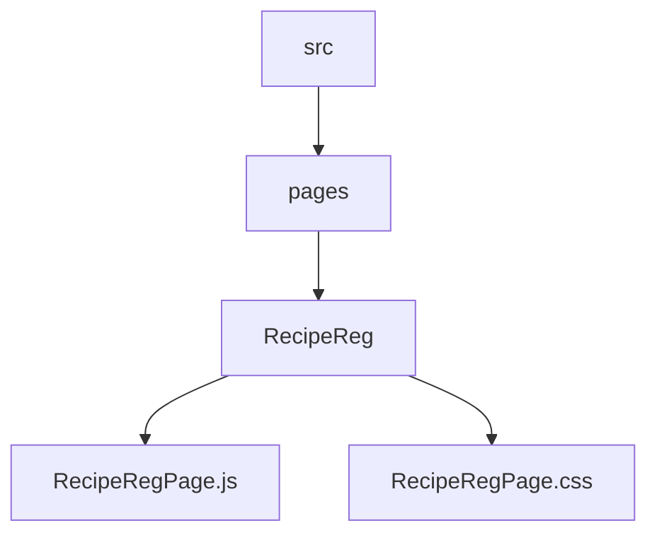
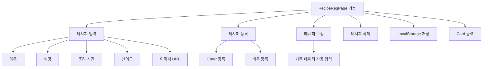
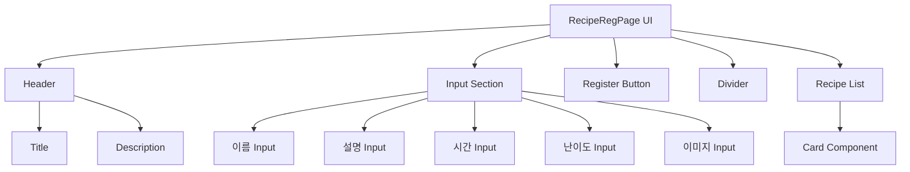
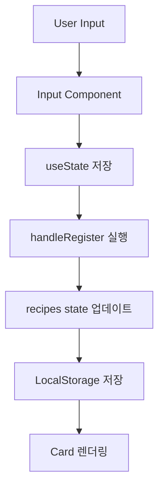
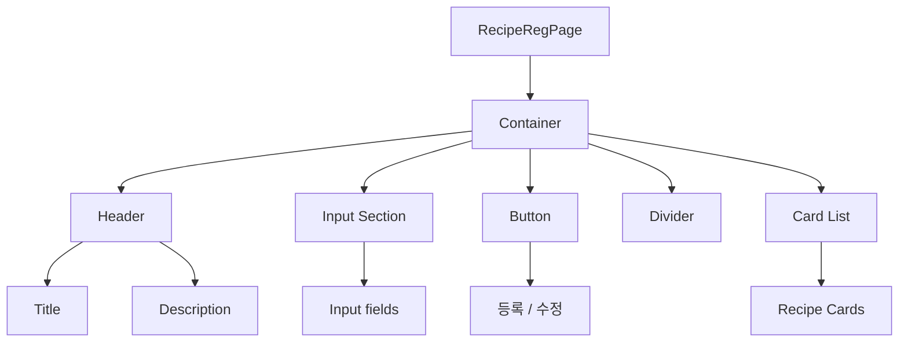
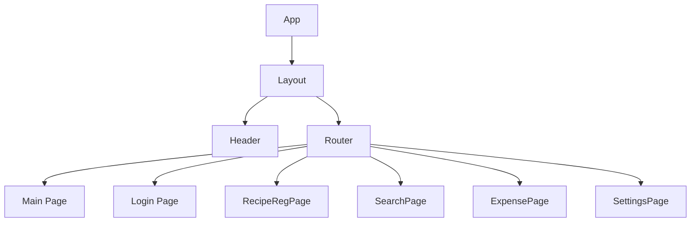

# RecipeRegPage 설계 문서

---

## 1. 개요 (Overview)

RecipeRegPage는 사용자가 직접 레시피를 등록하고 관리할 수 있는 페이지이다.

사용자는 다음 정보를 입력하여 자신만의 레시피를 생성할 수 있다:

- 레시피 이름
- 설명
- 조리 시간
- 난이도
- 이미지 URL

등록된 레시피는 Card 컴포넌트 형태로 화면에 출력되며,
수정 및 삭제 기능을 통해 관리할 수 있다.

또한 LocalStorage를 활용하여 새로고침 이후에도 데이터가 유지된다.

---

## 2. 개발 환경

| 항목 | 내용 |
| ------ | ------ |
| Framework | React |
| Language | JavaScript |
| Routing | React Router |
| Component | Input, Button, Card |
| Styling | CSS |
| Storage | LocalStorage |

---

## 3. 폴더 구조

### 구성 요소

- RecipeRegPage.js : 레시피 등록 / 수정 / 삭제 로직
- RecipeRegPage.css : UI 스타일

---

## 4. RecipeRegPage 목적

RecipeRegPage는 다음 기능을 제공한다:

- 레시피 등록
- 레시피 수정
- 레시피 삭제
- 레시피 카드 출력
- LocalStorage 저장

→ 사용자가 개인 레시피를 관리할 수 있는 CRUD 페이지

---

## 5. 주요 기능

---

## 6. UI 구조

---

## 7. 데이터 흐름

---

## 8. DOM 구조

---

## 9. 전체 프로젝트 구조에서 위치

---

## 10. 한 줄 핵심

> RecipeRegPage는 사용자가 레시피를 생성, 수정, 삭제하고 LocalStorage로 관리하는 CRUD 기반 페이지이다.
