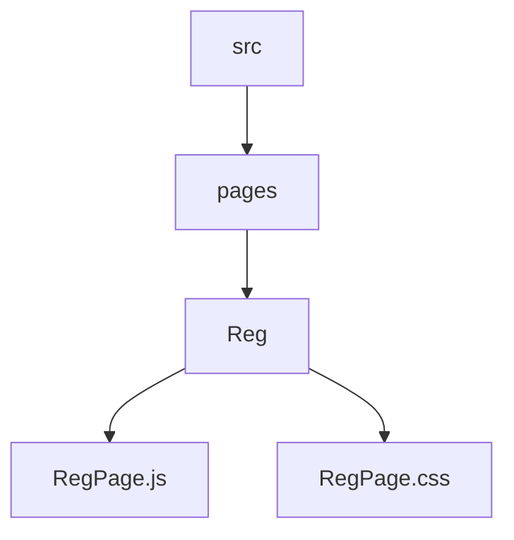
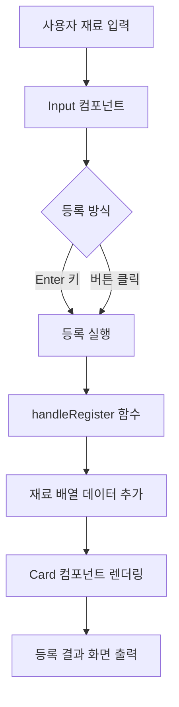
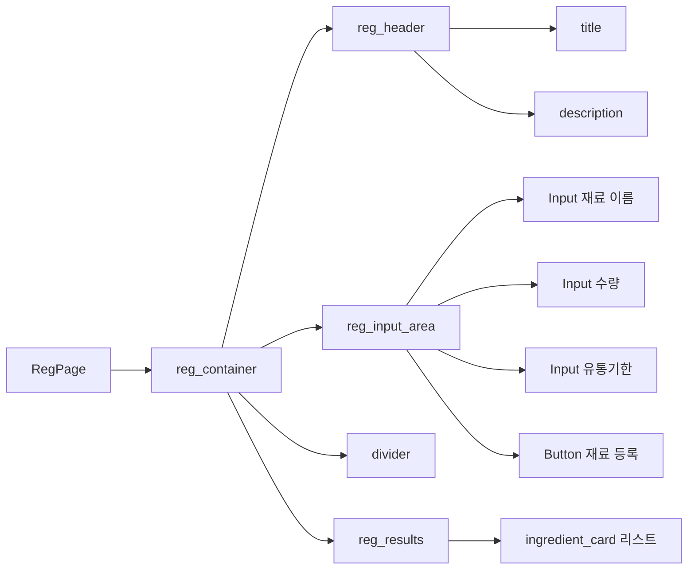
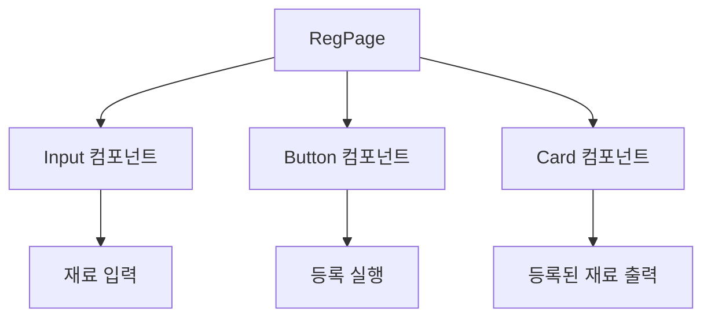
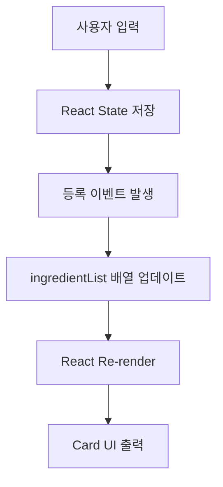
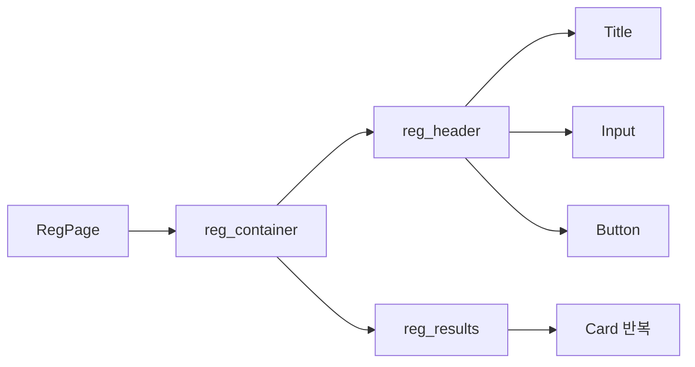
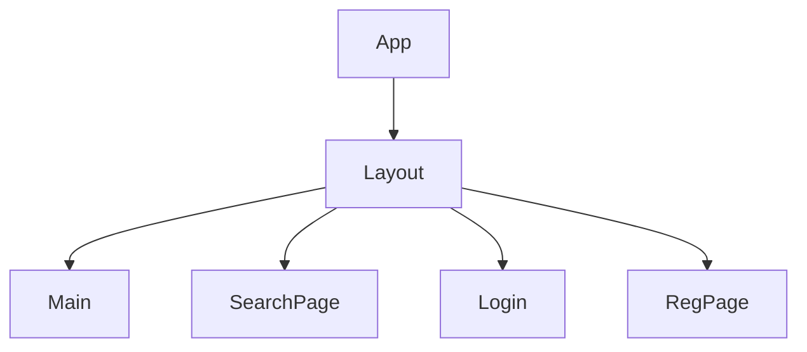

# 📦 RegPage 설계 문서

## 1. 개요 (Overview)

RegPage는 사용자가 냉장고에 보유한 재료를 등록하고 관리할 수 있는 페이지이다.

사용자는 다음 정보를 입력하여 재료를 등록할 수 있다.

- 재료 이름
- 수량
- 유통기한

등록된 재료는 **Card 형태의 UI**로 화면에 출력된다.

### 목적

- 냉장고 재료 관리
- 식재료 소비기한 관리
- 재료 기반 레시피 추천을 위한 데이터 확보

---

# 2. 개발 환경

| 항목 | 내용 |
|-----|-----|
| Framework | React |
| Language | JavaScript |
| Routing | React Router |
| Component | Input, Button |
| Styling | CSS |

---

# 3. 폴더 구조

### 구성 요소

| 파일 | 역할 |
|-----|-----|
| RegPage.js | 재료 등록 및 UI 구조 |
| RegPage.css | 재료 등록 페이지 스타일 |

---

# 4. RegPage 목적

RegPage는 다음 기능을 제공한다.

- 재료 등록
- 등록된 재료 목록 출력
- 카드 형태 UI 제공

이를 통해 사용자는 **냉장고 식재료를 관리**할 수 있다.

---

# 5. 주요 기능

1. 재료 등록
2. Enter 키 등록
3. 입력 초기화
4. 재료 삭제
5. 재료 수정
6. 유통기한 D-day 표시
7. LocalStorage 저장
8. 새로고침 데이터 유지
9. 등록된 재료 없을 때 안내

---

# 6. 등록 기능 흐름

---

# 7. UI 구조

---

# 8. 컴포넌트 구조

---

# 9. 데이터 흐름

---

# 10. 상태 관리

RegPage에서는 **React useState**를 사용하여 상태를 관리한다.

```javascript
const [ingredient, setIngredient] = useState("");
const [ingredientList, setIngredientList] = useState([]);
```

# 11. 등록 처리 흐름




# 12. DOM 구조
```mermaid
flowchart TD
    A[User] --> B[RegPage]

    B --> C[Input Components]
    C --> D[React State]

    D --> E{등록 버튼 클릭}

    E -->|등록| F[POST /ingredients]
    E -->|수정| G[PUT /ingredients (id)]
    E -->|삭제| H[DELETE /ingredients (id)]

    F --> I[DB 저장]
    G --> I
    H --> I

    I --> J[UI Card 업데이트]
```

# 13. 전체 프로젝트 구조에서 위치


# 한 줄 핵심
	RegPage는 사용자의 냉장고 재료를 등록하고 관리하는 페이지이다.