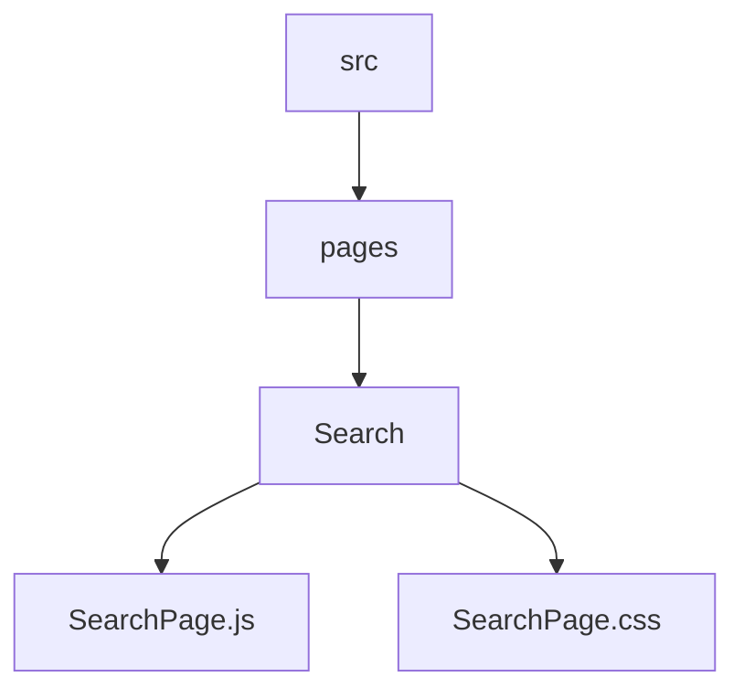
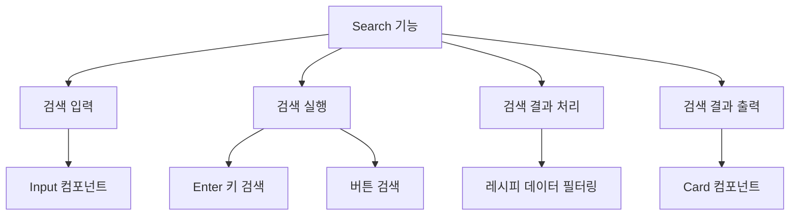
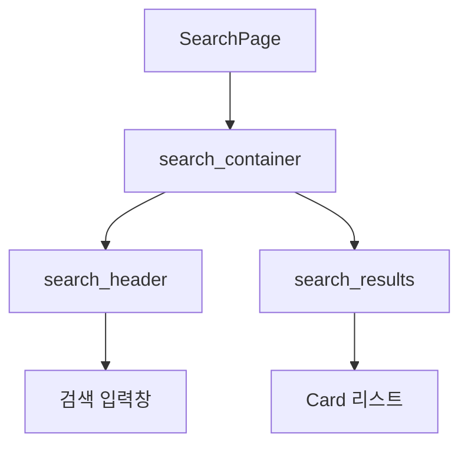
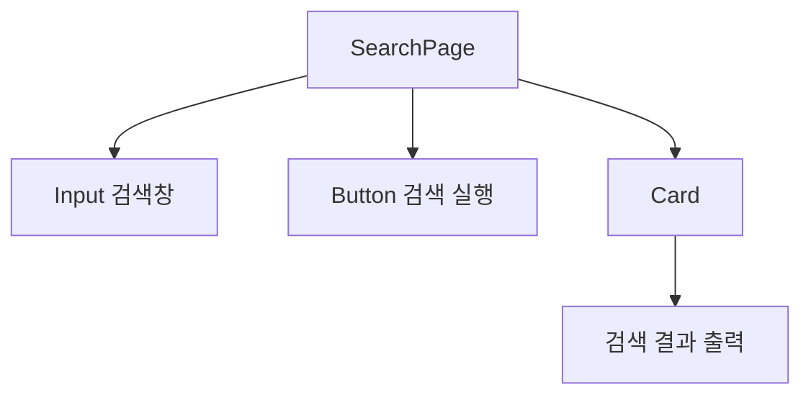
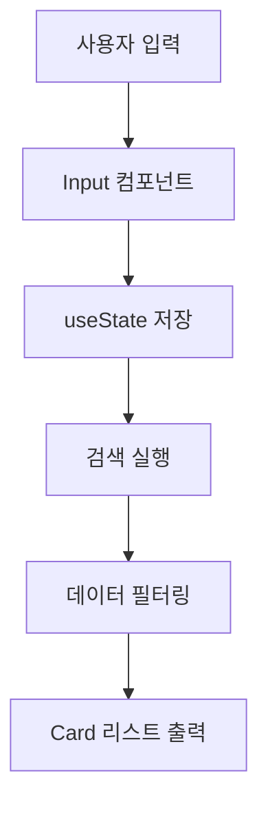
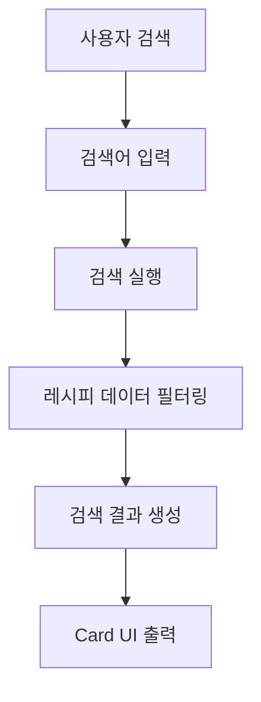
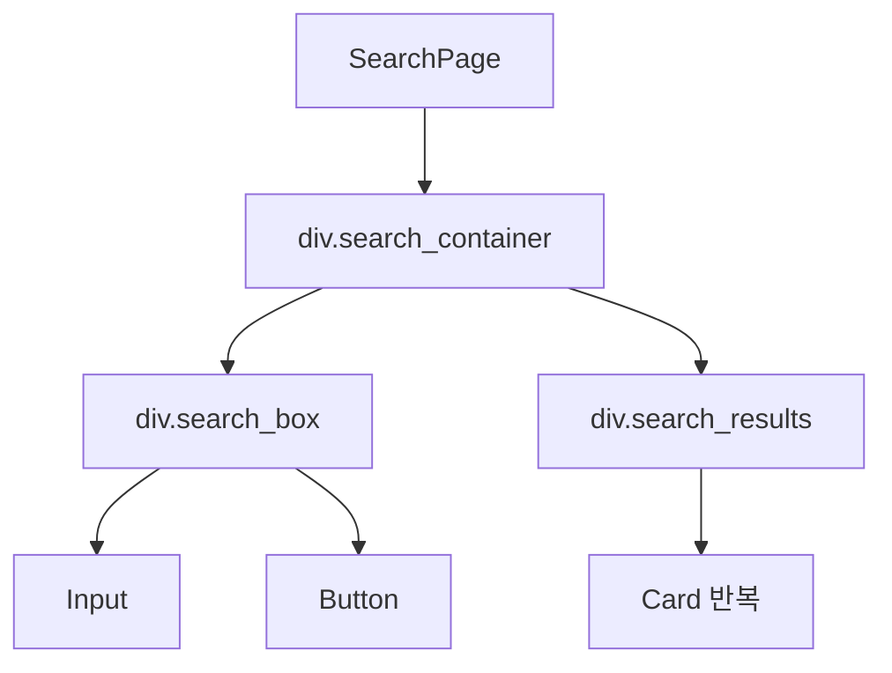
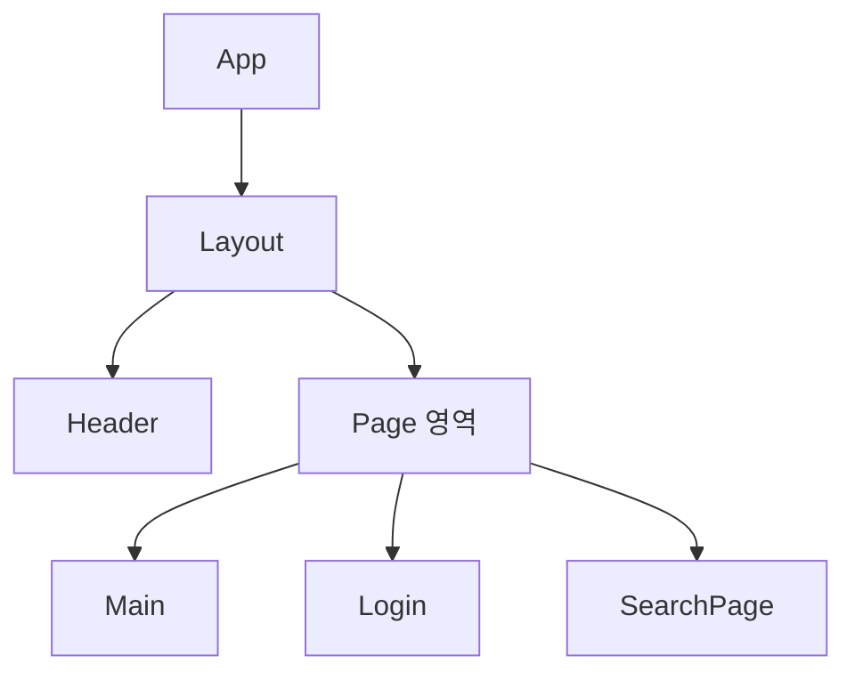

# 🔎 SearchPage 설계 문서

## 1. 개요 (Overview)

SearchPage는 사용자가 레시피를 검색할 수 있는 페이지이다.

사용자는 검색창에 **재료명 또는 요리 이름**을 입력하여 레시피를 찾을 수 있으며  
검색 결과는 **Card 컴포넌트**를 활용하여 리스트 형태로 출력된다.

---

## 2. 개발 환경

| 항목 | 내용 |
| ----- | ----- |
| Framework | React |
| Language | JavaScript |
| Routing | React Router |
| Component | Input, Button |
| Styling | CSS |

---

## 3. 폴더 구조



### 구성 요소

| 파일 | 역할 |
| ---- | ---- |
| SearchPage.js | 검색 기능 및 UI 구조 |
| SearchPage.css | 검색 페이지 스타일 |

---

## 4. SearchPage 목적

SearchPage는 다음 기능을 제공한다.

- 레시피 검색
- 검색 결과 출력
- 레시피 카드 표시

---

## 5. 주요 기능



---

## 6. UI 구조



---

## 7. 컴포넌트 구조

### SearchPage는 다음 컴포넌트로 구성된다



---

## 8. 데이터 흐름

### SearchPage의 핵심 구조는 검색 데이터 흐름이다



---

## 9. 상태 관리

### SearchPage에서는 React의 useState를 사용하여 검색 데이터를 관리한다

#### 예시 코드

```javascript
const [query, setQuery] = useState("");
const [results, setResults] = useState([]);
```

| 상태 | 역할 |
| ----- | ----- |
| query | 사용자 검색어 저장 |
| results | 검색 결과 레시피 데이터 저장 |

---

## 10. 검색 처리 흐름



---

## 11. Card 출력 구조

### 검색 결과는 Card 컴포넌트를 사용하여 출력된다

#### 예시 코드

```javascript
{results.map((recipe) => (
  <Card
    key={recipe.id}
    title={recipe.title}
    description={recipe.description}
    time={recipe.time}
    difficulty={recipe.difficulty}
    servings={recipe.servings}
  />
))}
```

---

## 12. UI 구조 (DOM)



## 13. SearchPage 특징

SearchPage는 다음과 같은 특징을 가진다.

- **검색 중심 UI**
  - 사용자가 원하는 레시피를 빠르게 찾을 수 있도록 검색 중심으로 설계하였다.

- **Card 기반 결과 출력**
  - 검색 결과를 Card 컴포넌트 형태로 출력하여 정보를 직관적으로 확인할 수 있다.

- **컴포넌트 재사용**
  - Input, Button, Card 컴포넌트를 재사용하여 코드 중복을 줄이고 유지보수성을 높였다.

- **데이터 기반 렌더링**
  - 검색 결과 데이터에 따라 UI가 자동으로 변경되는 구조를 사용하였다.

- **실시간 검색 자동완성**
  - 사용자가 입력을 시작하면 레시피 데이터에서 매칭되는 항목을 실시간으로 보여준다.

---

## 14. 전체 구조 흐름


