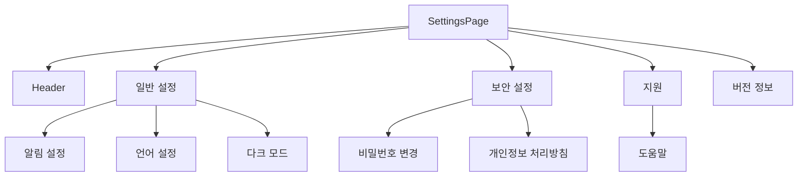
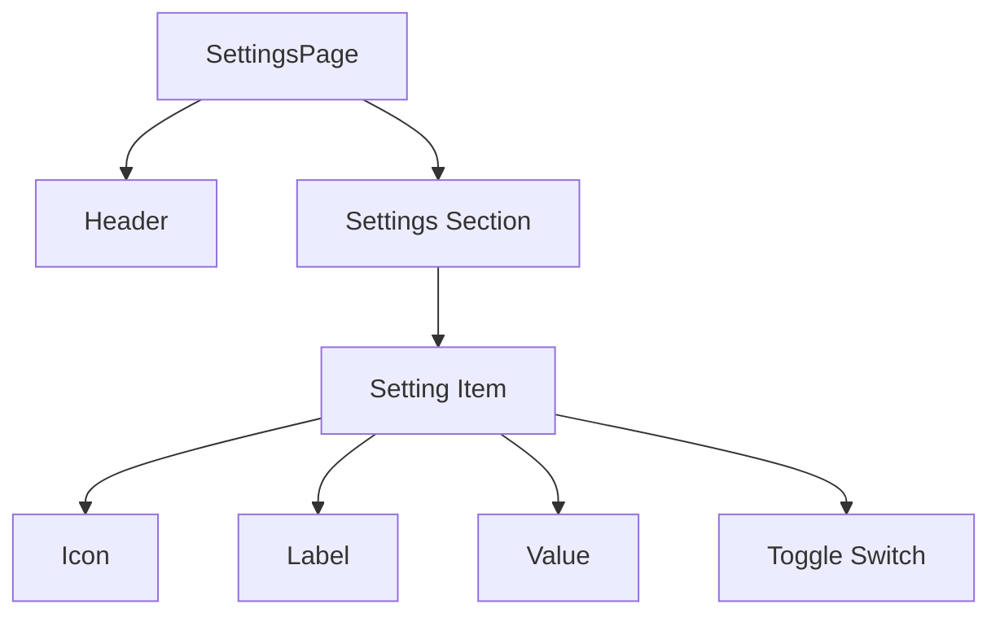
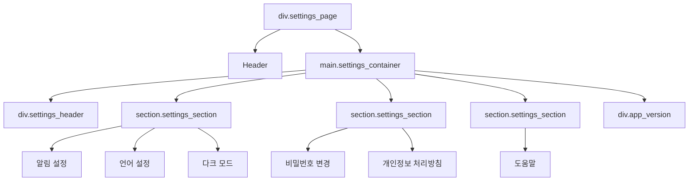
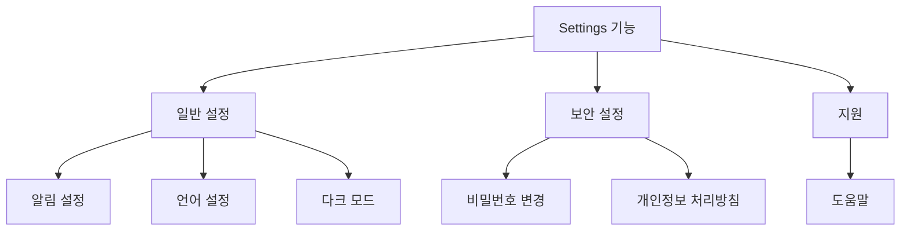
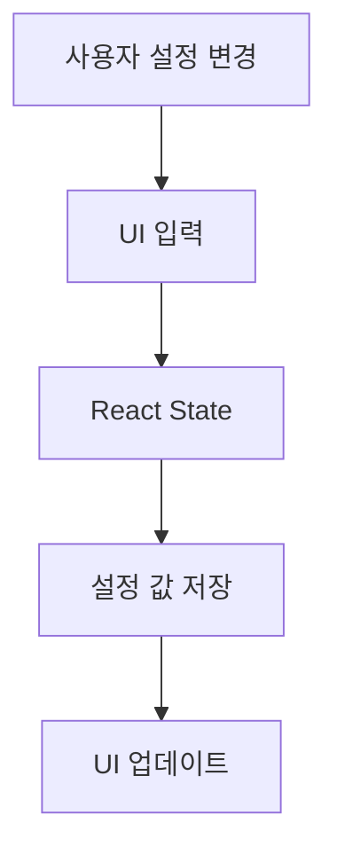
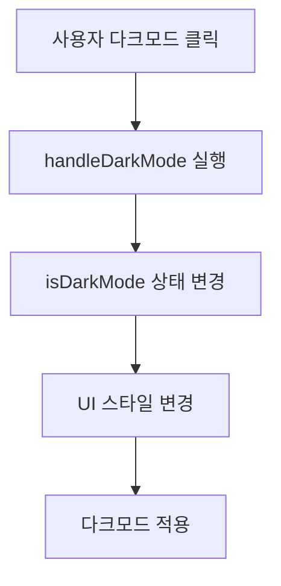
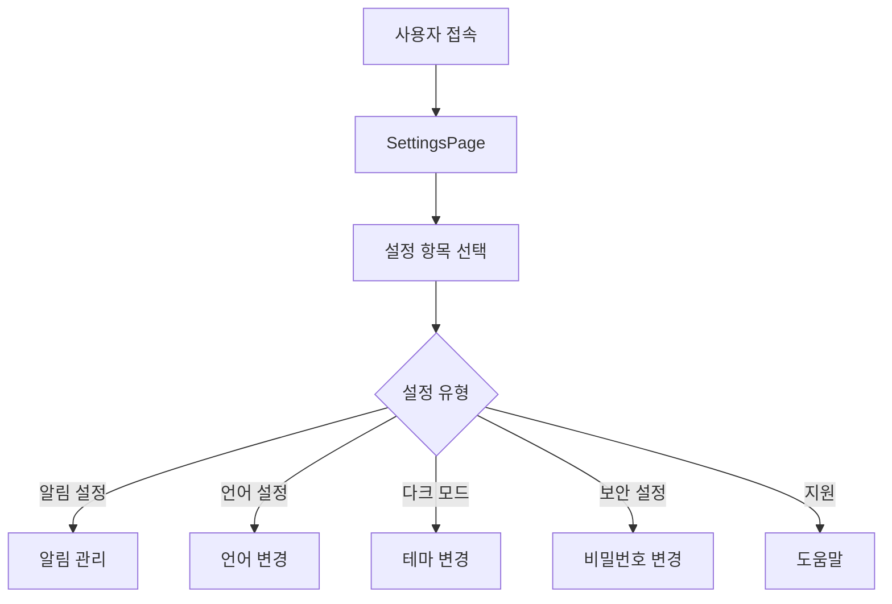

# ⚙️ SettingsPage 설계 문서

---

# 1. 개요 (Overview)

SettingsPage는 서비스의 **사용자 환경을 관리하는 설정 페이지**이다.

사용자는 이 페이지에서 다음과 같은 설정을 관리할 수 있다.

- 알림 설정
- 언어 설정
- 다크 모드 설정
- 보안 설정
- 도움말

SettingsPage는 서비스 전반의 사용자 경험을 제어하는 **환경 설정 관리 페이지** 역할을 수행한다.

---

# 2. 개발 환경

| 구분 | 기술 | 설명 |
|---|---|---|
| Framework | React | 컴포넌트 기반 프론트엔드 개발 |
| Language | JavaScript | UI 로직 구현 |
| Routing | React Router | 페이지 이동 관리 |
| Styling | CSS | 화면 스타일링 |
| Icon Library | Lucide React | 설정 메뉴 아이콘 |
| State Management | React useState | UI 상태 관리 |
| Common Component | Header | 공통 상단 네비게이션 |

---

# 3. SettingsPage 목적

SettingsPage의 주요 목적은 다음과 같다.

### 사용자 환경 설정

사용자가 서비스 UI 및 기능 환경을 직접 설정할 수 있도록 한다.

예시

- 다크 모드
- 언어 설정
- 알림 설정

---

### 계정 보안 관리

사용자의 계정 보안 관련 설정을 관리한다.

예시

- 비밀번호 변경
- 개인정보 처리방침 확인

---

### 서비스 지원 제공

서비스 사용 중 도움을 받을 수 있는 기능을 제공한다.

예시

- 도움말 페이지
- 서비스 정보 제공

---

# 4. UI 구조



---

# 5. 컴포넌트 구조



---

## 6. DOM 구조



---

## 7. 기능 구조



---

## 8. 데이터 흐름



SettingsPage의 설정 데이터 흐름은 다음과 같다.
	1.	사용자가 설정 항목을 클릭하거나 토글을 변경한다.
	2.	이벤트 핸들러가 실행된다.
	3.	React useState 상태가 업데이트된다.
	4.	변경된 상태에 따라 UI가 다시 렌더링된다.

---

## 9. 상태 관리

SettingsPage에서는 React의 **useState**를 사용하여 사용자 설정 상태를 관리한다.

| 상태 변수 | 설명 |
|---|---|
| isDarkMode | 다크 모드 활성화 여부 |
| setIsDarkMode | 다크 모드 상태 변경 함수 |

### 상태 코드 예시

```javascript
const [isDarkMode, setIsDarkMode] = useState(false);
```
---


## 10. 다크 모드 동작 구조



---

## 11. 설정 기능 목록

| 카테고리 | 기능 | 설명 |
|---|---|---|
| 일반 | 알림 설정 | 서비스 알림 관리 |
| 일반 | 언어 설정 | 서비스 언어 변경 |
| 일반 | 다크 모드 | UI 테마 변경 |
| 보안 | 비밀번호 변경 | 계정 보안 관리 |
| 보안 | 개인정보 처리방침 | 정책 확인 |
| 지원 | 도움말 | 사용자 가이드 |

---

## 12. 확장성 (Scalability)

SettingsPage는 향후 다음 기능으로 확장할 수 있도록 설계한다.

### 1️⃣ 알림 시스템 확장

식재료 관리 서비스와 연동하여 **유통기한 알림 기능**을 제공할 수 있다.

예시

- 식재료 유통기한 알림
- 레시피 추천 알림
- 냉장고 재료 부족 알림

---

### 2️⃣ 사용자 계정 관리 기능 확장

사용자 계정 관련 설정 기능을 추가할 수 있다.

| 기능 | 설명 |
|---|---|
| 이메일 변경 | 사용자 이메일 수정 |
| 로그아웃 | 계정 로그아웃 |
| 회원 탈퇴 | 사용자 계정 삭제 |

---

### 3️⃣ UI 테마 확장

사용자가 다양한 테마를 선택할 수 있도록 UI 설정 확장 가능

| 테마 | 설명 |
|---|---|
| Light Mode | 기본 UI 테마 |
| Dark Mode | 눈의 피로를 줄이는 어두운 테마 |
| Custom Theme | 사용자 지정 색상 테마 |

---

## 13. 전체 서비스 흐름

