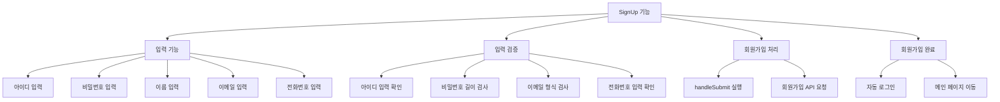
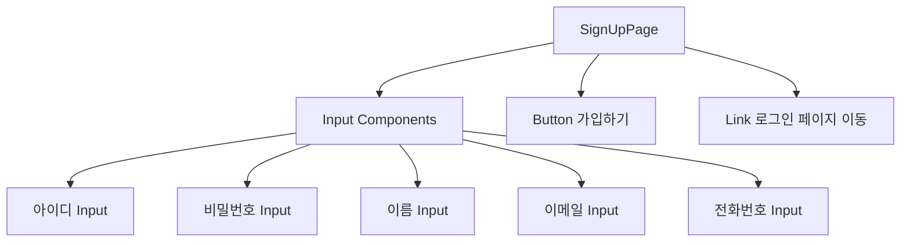
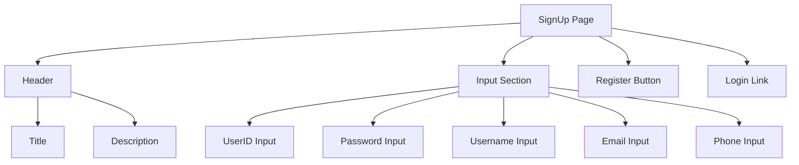
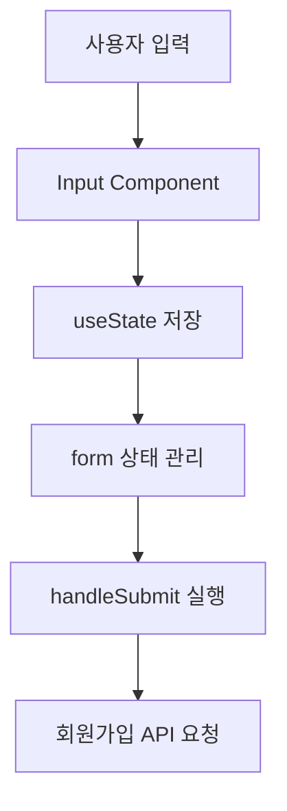
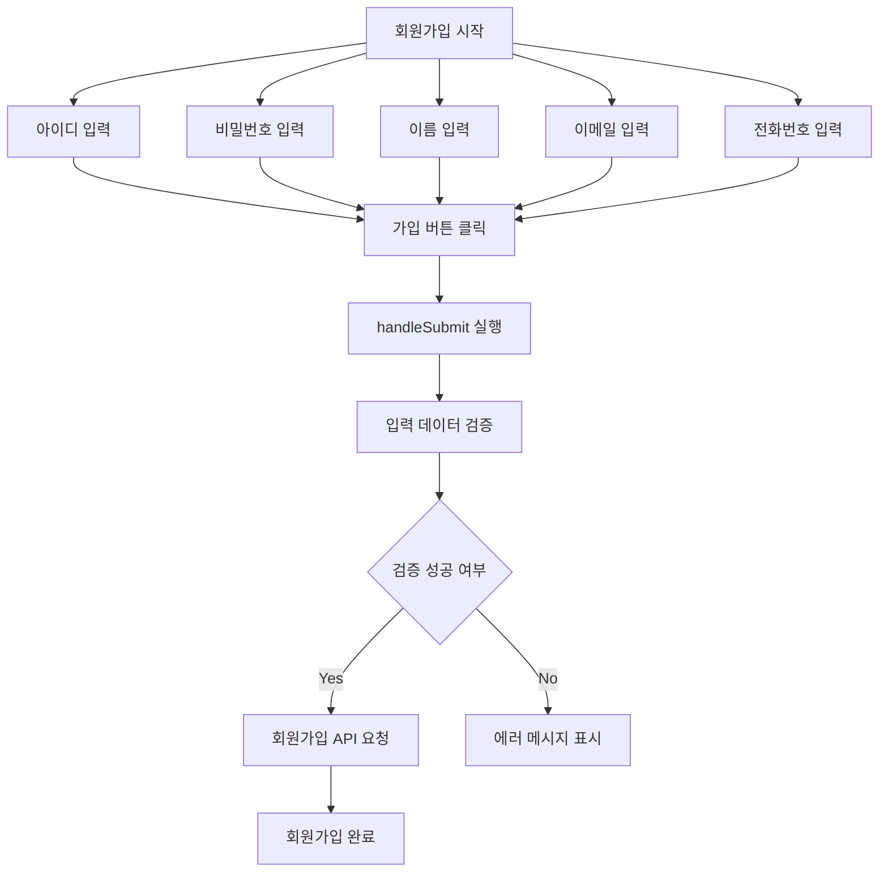
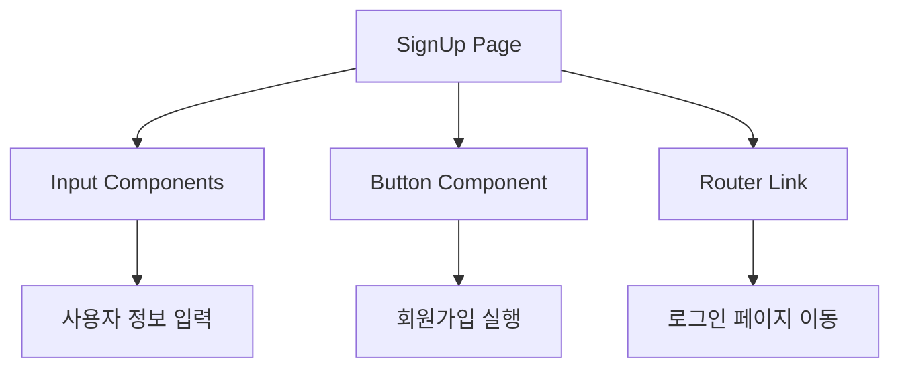

# SignUpPage 설계 문서

## 1. 개요 (Overview)

SignUpPage는 사용자가 **zero-naeng-fe 서비스에 회원가입**을 할 수 있도록 하는 페이지이다.

사용자는 다음 정보를 입력하여 계정을 생성할 수 있다.

- 아이디
- 비밀번호
- 이름
- 이메일
- 전화번호

회원가입이 완료되면 사용자는 로그인하여 서비스의 기능을 사용할 수 있다.

---

# 2. 개발 환경

| 항목 | 내용 |
|-----|-----|
| Framework | React |
| Language | JavaScript |
| Routing | React Router |
| HTTP Client | Axios |
| Styling | CSS |

---

# 3. SignUp 페이지 목적

SignUp 페이지는 **사용자의 계정을 생성하는 기능을 제공**한다.

사용자는 자신의 개인정보를 입력하여 서비스에 가입할 수 있으며  
회원가입이 완료되면 **자동 로그인 또는 로그인 페이지 이동**이 가능하다.

---

# 4. SignUp 주요 기능



## 5. 컴포넌트 구조

SignUp 페이지는 **입력 폼과 버튼 중심의 구조**로 구성된다.
### SignUp 페이지 구조



---

## 6. UI 구조


---

## 7. 핵심 기능 요약

| 기능 | 설명 |
|-----|-----|
| 입력 관리 | useState로 입력 상태 관리 |
| 입력 검증 | 비밀번호 길이 및 이메일 형식 검사 |
| 에러 표시 | 입력 오류 시 메시지 표시 |
| 회원가입 실행 | handleSubmit 함수 실행 |
| API 요청 | 회원가입 API 호출 |
| 페이지 이동 | 회원가입 후 페이지 이동 |

---

## 8. 상태 관리

SignUp 페이지에서는 **React의 useState를 사용하여 입력 상태를 관리한다.**

### 상태 선언

```javascript
const [form, setForm] = useState({
  userid: "",
  password: "",
  username: "",
  email: "",
  phone: "",
});
```
---

## 9. 상태 역할

SignUp 페이지에서는 `useState`를 사용하여 사용자 입력 데이터를 관리한다.

### 상태 선언

```javascript
const [form, setForm] = useState({
  userid: "",
  password: "",
  username: "",
  email: "",
  phone: "",
});
```
---

## 10. 데이터 흐름 (Data Flow)

사용자가 입력한 회원가입 데이터는 다음과 같은 흐름을 통해 서버로 전달된다.


데이터 흐름 설명
	1.	사용자가 회원가입 정보를 입력한다.
	2.	입력값이 Input 컴포넌트를 통해 전달된다.
	3.	입력 데이터가 useState 상태(form)에 저장된다.
	4.	가입 버튼 클릭 시 handleSubmit 함수가 실행된다.
	5.	입력 데이터가 회원가입 API로 전송된다.

---

## 11. 회원가입 처리 흐름
사용자가 회원가입 버튼을 클릭하면 다음과 같은 과정이 수행된다.


---

## 12. 정리

SignUpPage는 **사용자의 계정을 생성하는 핵심 페이지**이며  
사용자가 서비스에 가입할 수 있도록 입력 UI와 회원가입 처리 기능을 제공한다.

사용자는 아이디, 비밀번호, 이름, 이메일, 전화번호 정보를 입력하여  
서비스 계정을 생성할 수 있으며 회원가입이 완료되면 서비스 이용이 가능하다.

---

### 제공 기능

- 사용자 회원가입 기능
- 입력 데이터 유효성 검사
- 회원가입 API 요청
- 로그인 페이지 이동

---

### SignUp 페이지 구성 요소

| 구성 요소 | 역할 |
|-----------|------|
| Input Component | 사용자 정보를 입력 |
| Button Component | 회원가입 요청 실행 |
| Router Link | 로그인 페이지 이동 |

---

### SignUp 페이지 구조 요약

